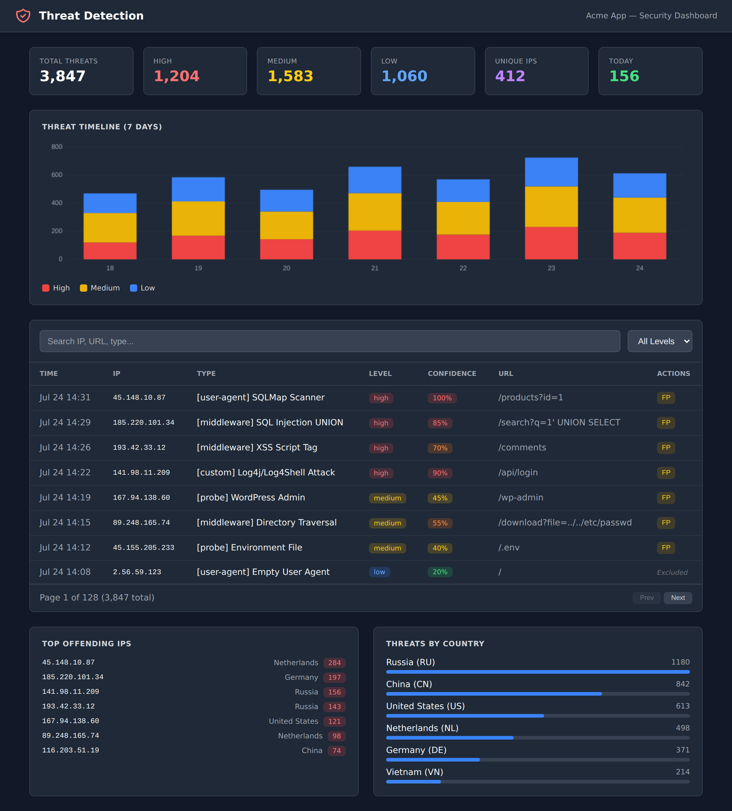

<p align="center">
  
  
  
  
  
</p>

# Laravel Threat Detection

**Passive intrusion detection for Laravel — see every SQL injection, XSS, scanner,
and bot probe hitting your app, logged with full context. It's an IDS, not a WAF:
it never blocks, filters, or modifies a request.**

<p align="center">
  
</p>

Drop it into any Laravel 10–13 app and it starts scanning every HTTP request against
175+ attack patterns, scoring each match by confidence and writing it to your database —
with a built-in dashboard, Slack alerts, geo-enrichment, and fail2ban/blocklist exports.
No request is ever blocked. Think security camera, not a lock: it shows you exactly who's
probing your routes, how often, and with what techniques.

> Extracted from a production app and battle-tested on real traffic. 213 tests, no runtime
> dependencies beyond Laravel itself, and no internet connection required for detection.

## Get started in under a minute

```bash
composer require jayanta/laravel-threat-detection
php artisan vendor:publish --tag=threat-detection-migrations
php artisan migrate
```

Then add the middleware to your `web` group (one line in `bootstrap/app.php` on Laravel 11+,
or `app/Http/Kernel.php` on Laravel 10) — full snippet in [Quick Start](#quick-start) below.
That's it; detection is live.

```bash
php artisan threat-detection:doctor   # confirms it is actually recording
```

---

## Where it fits: IDS vs WAF vs edge

This package is a **passive, application-level IDS** — it watches and records, it doesn't
block. It's meant to sit *alongside* a WAF or edge service, not replace one. Each layer sees
something the others can't:

| | **This package** (app IDS) | **WAF** (mod_security, Cloudflare WAF) | **Edge / CDN** (Cloudflare) |
|---|:---:|:---:|:---:|
| Blocks malicious requests | ❌ logs only | ✅ | ✅ |
| Full app context (exact route, decoded payload, authenticated user) | ✅ | ⚠️ partial | ❌ |
| Built-in dashboard + threat log in your DB | ✅ | ⚠️ varies | ⚠️ edge only |
| App-specific detections (e.g. Aadhaar / PAN / IFSC PII) | ✅ custom patterns | ❌ | ❌ |
| Works offline / no external service | ✅ | ⚠️ depends | ❌ |
| Stops traffic before it reaches your app | ❌ | ✅ edge | ✅ |
| Setup | one `composer require` | medium–high | low–medium |
| Cost | free, MIT | varies | free tier + paid |

**The short version:** an edge/WAF is your lock on the door; this is the security camera
*inside*, with the app context to tell you exactly what's being tried on which route, by
whom, and how often. Use it to feed real decisions — fail2ban bans, rate limits,
geo-blocking — with data your edge layer never sees.

### What it deliberately is NOT

- **Not a WAF.** It never blocks, filters, or modifies a request. Use Cloudflare,
  mod_security, or a real WAF for enforcement. (No edge layer to hand off to? The
  [operator-side helpers](#acting-on-the-data-operator-side-blocking) expose the
  package's decisions so you can write your own five-line blocking middleware —
  the enforcement code stays yours, not the package's.)
- **Not a replacement for secure coding.** Parameterized queries, input validation, and
  output escaping are your actual defenses. This package assumes your code is already
  secure and gives you *visibility*, not protection.
- **Not an edge service.** If you can put Cloudflare in front, do — then add this for the
  application-level detail edge services can't see.

---

## Requirements

- PHP 8.2+ (Laravel 13 requires PHP 8.3+)
- Laravel 10.x, 11.x, 12.x, or 13.x
- Any database supported by Laravel (MySQL, PostgreSQL, SQLite, SQL Server)
- Any cache driver -  **no Redis or queue worker required**. Redis/Memcached is
  only *recommended* to enable the optional DDoS check (which auto-disables on
  non-atomic drivers). Queued writes are opt-in and off by default.

---

## How It Works

1. A middleware scans every incoming HTTP request
2. The request is checked against 175+ regex patterns covering SQL injection, XSS, RCE, file traversal, SSRF, LDAP, XPath, SSTI, and more
3. If a threat pattern matches, a record is written to your `threat_logs` database table with the IP, URL, threat type, severity level, and a confidence score
4. Optionally, a Slack alert is sent for high-severity threats
5. The request proceeds normally -  **nothing is blocked**

No internet connection is needed for detection.

---

## Quick Start

### 1. Install the package

```bash
composer require jayanta/laravel-threat-detection
```

### 2. Publish migrations and run them

> **This step is required.** Without it, the package will detect threats but cannot store them in the database. If you skip this step, your `threat_logs` table won't exist and all detections will be silently lost (you'll only see errors in `storage/logs/laravel.log`).

```bash
php artisan vendor:publish --tag=threat-detection-migrations
php artisan migrate
```

This creates two tables: `threat_logs` (stores detected threats) and `threat_exclusion_rules` (stores false positive rules).

**Verify tables were created:**
```bash
php artisan migrate:status
```
Look for `create_threat_logs_table`, `add_confidence_to_threat_logs_table`, and `create_threat_exclusion_rules_table` -  all should show `Ran`.

### 3. Register the middleware

The middleware is what scans requests. You need to add it to your `web` middleware group.

**If you use Laravel 11 or 12** -  open `bootstrap/app.php`:

```php
->withMiddleware(function (Middleware $middleware) {
    $middleware->web(append: [
        \JayAnta\ThreatDetection\Http\Middleware\ThreatDetectionMiddleware::class,
    ]);
})
```

> **How to check your Laravel version:** Run `php artisan --version` in your terminal.

**If you use Laravel 10** -  open `app/Http/Kernel.php`:

```php
protected $middlewareGroups = [
    'web' => [
        // ... existing middleware
        \JayAnta\ThreatDetection\Http\Middleware\ThreatDetectionMiddleware::class,
    ],
];
```

### 4. (Optional) Publish the config file

```bash
php artisan vendor:publish --tag=threat-detection-config
```

The package works with sensible defaults. Publishing the config lets you customize detection patterns, sensitivity modes, Slack notifications, and more. If you skip this step, everything still works.

**That's it.** Your app is now detecting threats.

---

## Verify It Works

After installation, trigger a test threat and confirm it was logged.

### Step 1: Start your app

```bash
php artisan serve
```

### Step 2: Open a test URL in your browser

Append a malicious query parameter to **any existing route** in your app (your homepage, a product page, etc.). For example:

**SQL Injection:**
```
http://localhost:8000/?q=' UNION SELECT * FROM users--
```

**XSS (Cross-Site Scripting):**
```
http://localhost:8000/?q=<script>alert(1)</script>
```

**Directory Traversal:**
```
http://localhost:8000/?file=../../etc/passwd
```

**RCE (Remote Code Execution):**
```
http://localhost:8000/?cmd=system('ls -la')
```

**Shellshock (CVE-2014-6271):**
```
http://localhost:8000/?cmd=() { :;}; /bin/bash
```

**Windows Command Injection:**
```
http://localhost:8000/?cmd=powershell -c whoami
```

**DROP TABLE (SQL DDL):**
```
http://localhost:8000/?q=DROP TABLE users
```

> Use a route that actually exists in your app (like `/`). If the URL returns a 404, the middleware may not have run.

### Step 3: Check that threats were logged

**Option A -  Artisan command (quickest):**
```bash
php artisan threat-detection:stats
```
You should see a table with `Total Threats`, severity counts, and top IPs.

**Option B -  Tinker:**
```bash
php artisan tinker
```
```php
DB::table('threat_logs')->latest()->take(5)->get(['ip_address', 'type', 'threat_level', 'confidence_score']);
```

**Option C -  Laravel log file:**
Each detected threat is written as a warning to `storage/logs/laravel.log`:
```
[high] Threat Detected: [middleware] SQL Injection UNION from 127.0.0.1 (http://localhost:8000/?q=...) [confidence: 50%]
```

### Things to know when testing

| Behavior | Explanation |
|----------|-------------|
| Same threat only logs once per 5 minutes | Deduplication: same IP + same threat type is cached for 5 minutes. Use **different attack types** for each test, or wait between tests. |
| `curl` requests trigger extra detection | Using `curl` also logs a "cURL Command" user-agent detection (low severity). This is expected -  the package detects automated tools. |
| The package never blocks requests | Your app continues to function normally. Detection is passive. |
| No Slack setup needed | Notifications are off by default. |
| No internet connection needed | Core detection is 100% local. Only the optional `threat-detection:enrich` command calls an external API for geo-data. |

### Troubleshooting

**Start here — one command answers most of this:**

```bash
php artisan threat-detection:doctor
```

It checks the things that make detection fail *silently* — where the dashboard
stays empty, which looks identical to "no attacks" — and prints the exact fix
for each. It exits non-zero on a real failure, so it is safe to run in CI or a
deploy step.

```
  Threat Detection — health check

  PASS  Detection is enabled for this environment
  FAIL  'threat_logs' is missing confidence_label — EVERY threat is being discarded
        Run: php artisan vendor:publish --tag=threat-detection-migrations && php artisan migrate
  WARN  1 custom pattern(s) shadow a built-in: Localhost SSRF
        Your copy runs instead of the maintained one, so later fixes to it never reach you.
```

What it covers: detection enabled for this environment; every column the writer
needs (a missing one discards **every** threat); dashboard/API columns; the
exclusion-rules table; whether the middleware is actually wired to a route or
group; published config that predates this version; custom patterns shadowing
built-in ones; a cache driver that cannot do DDoS counting; and a dashboard or
API left open without authentication.

**"I tested but `threat-detection:stats` shows zero threats" / "Threats are not stored in the database"**

If the doctor passed, the install is fine and the problem is the test request
itself. Three things it cannot check for you:

| Check | How to verify |
|-------|---------------|
| IP is not whitelisted | If you added `THREAT_DETECTION_WHITELISTED_IPS` to `.env`, remove it during testing |
| Used an existing route | The test URL must match a real route (e.g., `/`). A 404 means the middleware never ran |
| Dedup cache | Same IP + same attack type is cached for 5 minutes -  try a different attack type |

> Running `php artisan migrate` alone is never enough: the migration files live
> inside the package and must be published to your app's `database/migrations/`
> first. The doctor prints the exact command when this is the problem.

**"API returns 401 Unauthorized"**

See [API Authentication](#api-authentication) below.

**"Dashboard shows 404"**

The dashboard is disabled by default. Add `THREAT_DETECTION_DASHBOARD=true` to `.env` and clear route cache:
```bash
php artisan route:clear
```

---

## Features

- **175+ Detection Patterns** -  SQL injection (UNION, DDL, DML, file ops), XSS (script, SVG, CSS expression), RCE, directory traversal, SSRF, XXE, Log4Shell, NoSQL injection, command injection (Linux + Windows), LDAP injection, XPath injection, SSTI, CRLF injection, Java deserialization, and more
- **53 Bot/Scanner Signatures** -  SQLMap, Nikto, Nmap, Burp Suite, FeroxBuster, FFUF, XSStrike, Dalfox, Netsparker, and 20+ other security scanners
- **AI Scraper Detection** -  GPTBot, ClaudeBot, ByteSpider, Common Crawl, and other AI training bots
- **Headless Browser Detection** -  HeadlessChrome, PhantomJS, Selenium, Puppeteer, Playwright
- **404 Probe Tracking** -  Detects reconnaissance probes hitting known vulnerable paths (`/wp-admin`, `/.env`, `/phpmyadmin`, `/actuator`, etc.) with 50+ default probe paths
- **DDoS Monitoring** -  Rate-based threshold detection with configurable windows
- **Confidence Scoring** -  Each threat gets a 0-100 confidence score based on pattern count, context, and signals
- **Evasion Resistance** -  Normalization pipeline defeats SQL comment insertion, double URL encoding, HTML entity encoding, Unicode escapes, and hex escapes before pattern matching
- **CVE Detection** -  Shellshock (CVE-2014-6271), Spring4Shell (CVE-2022-22965), PHPUnit RCE (CVE-2017-9841), Drupalgeddon, Log4Shell
- **Context-Aware Detection** -  Patterns found in query strings score higher than those in the request body
- **Request Body Scanning** -  Both form-encoded and JSON (`application/json`) request bodies are inspected
- **Safe Fields** -  Exclude specific form fields from scanning (for CMS editors, code inputs, search fields)
- **False Positive Reporting** -  Mark threats as false positives from the dashboard; auto-creates exclusion rules
- **Three Detection Modes** -  `strict`, `balanced` (default), and `relaxed` -  tunable sensitivity
- **Content Path Suppression** -  Whitelist CMS/blog paths to suppress low/medium alerts from rich content
- **PII Detection** -  Sensitive data exposure patterns (configurable per region)
- **Geo-Enrichment** -  Country, city, ISP, cloud provider identification via free API
- **Slack Alerts** -  Real-time notifications for high-severity threats (works on Laravel 10 and 11+)
- **Built-in Dashboard** -  Dark-mode Blade dashboard (Alpine.js + Tailwind CDN, zero build step)
- **Dashboard Auth Guard** -  Configurable authentication for dashboard and API (none, auth, role, or IP-based)
- **15 API Endpoints** -  Full REST API for building custom Vue/React/mobile dashboards
- **Fail2ban Export** -  Export detected IPs in fail2ban-compatible format or plain blocklist
- **Blocklist Export** -  Export IPs in nginx deny, Apache deny, CSV, or plain format
- **CSV Export** -  One-click threat log export (up to 10,000 rows)
- **Correlation Analysis** -  Detect coordinated attacks and attack campaigns across IPs
- **Performance Optimized** -  Category-based lazy pattern loading (only runs regex for relevant attack categories), early bailout for clean requests, browser UA short-circuit (skips 70+ checks for normal browsers), probe path hash lookup, batch DB inserts, configurable max detections per request
- **Database Agnostic** -  MySQL, PostgreSQL, SQLite, SQL Server
- **Zero Config** -  Works out of the box with sensible defaults
- **Safe by Design** -  The middleware catches its own errors. If detection fails, your app keeps running. Requests are never blocked.

---

## Configuration

The package works without any `.env` changes. All values below are optional -  add them only if you want to override the defaults.

```env
# Enable/disable detection globally (default: true)
THREAT_DETECTION_ENABLED=true

# Detection sensitivity (default: balanced)
# Options: strict, balanced, relaxed
THREAT_DETECTION_MODE=balanced

# Custom table name (default: threat_logs)
# THREAT_DETECTION_TABLE=threat_logs

# Whitelist IPs to skip detection entirely (default: empty)
# Supports CIDR notation. Comma-separated.
# THREAT_DETECTION_WHITELISTED_IPS=10.0.0.0/8,192.168.1.0/24

# Static operator denylist read by ThreatDetection::isBlocklisted() (default: empty)
# The package itself never blocks — see "Acting on the Data" for the
# enforcement recipe. Supports CIDR. Whitelist wins on overlap.
# THREAT_DETECTION_BLOCKLISTED_IPS=203.0.113.0/24,198.51.100.7

# DDoS detection thresholds (defaults shown)
# THREAT_DETECTION_DDOS_THRESHOLD=300
# THREAT_DETECTION_DDOS_WINDOW=60

# Minimum confidence score to log a threat (default: 0)
# Threats below this score are silently ignored.
# THREAT_DETECTION_MIN_CONFIDENCE=0

# Slack notifications (disabled by default)
# THREAT_DETECTION_NOTIFICATIONS=true
# THREAT_DETECTION_SLACK_WEBHOOK=https://hooks.slack.com/services/YOUR/WEBHOOK/URL
# THREAT_DETECTION_SLACK_CHANNEL=#threat-alerts

# Dashboard (disabled by default)
# THREAT_DETECTION_DASHBOARD=true

# API endpoints (enabled by default)
# THREAT_DETECTION_API=true

# API rate limiting (default: 60 requests per minute)
# THREAT_DETECTION_API_THROTTLE=60,1

# Queue support -  offload DB writes to a queue (disabled by default).
# OPTIONAL: only enable if your app already runs a queue worker. When false
# (default), threats are written synchronously with a plain DB insert -  no
# Redis, no worker, nothing extra to run.
# THREAT_DETECTION_QUEUE=false
# THREAT_DETECTION_QUEUE_CONNECTION=redis
# THREAT_DETECTION_QUEUE_NAME=default

# Auto-purge old logs (disabled by default)
# Requires Laravel scheduler to be running.
# THREAT_DETECTION_RETENTION=false
# THREAT_DETECTION_RETENTION_DAYS=90

# 404 probe tracking (enabled by default)
# Detects bots hitting /wp-admin, /.env, /phpmyadmin, etc.
# THREAT_DETECTION_PROBE_TRACKING=true

# Max detections per request (default: 0 = unlimited)
# Stop scanning after N pattern matches per request.
# THREAT_DETECTION_MAX_DETECTIONS=0

# Dashboard auth guard (default: none)
# Options: none, auth, role, ip
# THREAT_DETECTION_DASHBOARD_GUARD=none
# THREAT_DETECTION_DASHBOARD_ROLE=admin
# THREAT_DETECTION_DASHBOARD_IPS=127.0.0.1

# API auth guard (default: none -  uses existing middleware config)
# THREAT_DETECTION_API_GUARD=none
```

### Detection Modes

| Mode | Confidence Threshold | Behavior |
|------|---------------------|----------|
| `strict` | 0 (logs everything) | All patterns active, lowest thresholds. Catches everything but may flag legitimate traffic. |
| `balanced` | 10 | Default. Confidence scoring active, standard thresholds. Good for most apps. |
| `relaxed` | 40 | Only high-severity patterns trigger. Best for content-heavy sites with frequent false positives. |

### Enabled Environments

By default, detection runs in `production`, `staging`, and `local`. To change, publish the config and edit:

```php
'enabled_environments' => ['production', 'staging', 'local'],
```

To disable detection in your test suite, set `APP_ENV=testing` (not in the list above) or add to your `phpunit.xml`:
```xml
<env name="THREAT_DETECTION_ENABLED" value="false"/>
```

### Config Reference

Publish the config file to see all available options:

```bash
php artisan vendor:publish --tag=threat-detection-config
```

Key config sections: `skip_paths` (paths to skip), `only_paths` (whitelist mode), `auth_paths` (smart detection for login routes), `content_paths` (suppress non-high alerts), `safe_fields` (exclude specific fields from scanning), `safe_paths` (path-aware field exclusion for nested JSON), `probe_tracking` (404 probe detection), `context_weights` (scoring multipliers), `threat_levels` (severity keyword mapping), `api_route_filtering` (suppress low/medium on API routes), `queue` (async processing), `retention` (auto-purge), `max_detections_per_request` (performance cap), `dashboard.guard` / `api.guard` (auth mode).

### Route Whitelisting (`only_paths`)

If your app has many routes but you only care about a few, use `only_paths` to scan **only** those routes. All other routes are automatically skipped -  no middleware overhead at all.

```php
// config/threat-detection.php
'only_paths' => [
    'admin/*',
    'api/*',
    'login',
    'register',
],
```

Leave empty (default) to scan all routes (subject to `skip_paths`). When both are configured, `only_paths` is checked first, then `skip_paths` applies within the matched set.

### Queue Support

By default, threat logging happens synchronously in the request cycle. For high-traffic apps, you can offload DB writes and Slack notifications to a queue:

```env
THREAT_DETECTION_QUEUE=true
THREAT_DETECTION_QUEUE_CONNECTION=redis
THREAT_DETECTION_QUEUE_NAME=threat-logs
```

This dispatches a `StoreThreatLog` job (3 retries, backoff 10s/30s). Detection still happens in real-time -  only the write is deferred.

### Auto-Purge (Retention Policy)

Automatically delete old threat logs on a daily schedule:

```env
THREAT_DETECTION_RETENTION=true
THREAT_DETECTION_RETENTION_DAYS=90
```

Requires Laravel's scheduler to be running (`php artisan schedule:run`). Runs daily at 02:00 via `threat-detection:purge`.

### ThreatDetected Event

Every confirmed threat dispatches a `ThreatDetected` event that you can listen to:

```php
// app/Providers/EventServiceProvider.php
use JayAnta\ThreatDetection\Events\ThreatDetected;

protected $listen = [
    ThreatDetected::class => [
        YourCustomListener::class,
    ],
];
```

The event carries `$threatLog` (full DB row array), `$ipAddress`, and `$threatLevel`. Use it to trigger custom actions -  send Telegram alerts, update a blocklist, feed a SIEM, etc.

### DdosThresholdExceeded Event

When a client crosses the configured DDoS threshold (`ddos.threshold` requests within
`ddos.window` seconds), a `DdosThresholdExceeded` event is dispatched alongside the threat
log entry:

```php
use JayAnta\ThreatDetection\Events\DdosThresholdExceeded;

protected $listen = [
    DdosThresholdExceeded::class => [
        YourFloodListener::class,
    ],
];
```

The event carries `$ipAddress`, `$requestCount`, `$threshold`, and `$windowSeconds`. It is
throttled to once per IP per dedup window (same throttle as the log row), so a flood can't
drown your listeners. Use it for alerting or to feed an external ban store; to *refuse*
over-threshold clients, use `ThreatDetection::isDdosThresholdExceeded($ip)` from your own
middleware instead — see [Acting on the Data](#acting-on-the-data-operator-side-blocking).

---

## Slack Notifications

Slack alerts are disabled by default. To enable:

```env
THREAT_DETECTION_NOTIFICATIONS=true
THREAT_DETECTION_SLACK_WEBHOOK=https://hooks.slack.com/services/YOUR/WEBHOOK/URL
THREAT_DETECTION_SLACK_CHANNEL=#threat-alerts
```

Only high-severity threats trigger notifications by default (configurable via `notify_levels` in the config).

**Laravel 10:** Uses the built-in `SlackMessage` notification class. No extra package needed.

**Laravel 11+:** The built-in Slack channel was removed. The package **automatically detects this and sends raw HTTP POST webhooks** to your Slack URL. No extra package needed. If you prefer the full notification channel, install:

```bash
composer require laravel/slack-notification-channel
```

---

## Dashboard

The package ships with a built-in dark-mode dashboard (Alpine.js + Tailwind CDN -  no build step required).

```
+-------------------------------------------------------------------------+
|  Threat Detection Dashboard                                              |
+-------------------------------------------------------------------------+
|  Total: 847  |  High: 23  |  Med: 156  |  Low: 668  |  IPs: 94         |
+-------------------------------------------------------------------------+
|  [Timeline Chart - 7 Day Stacked Bar]                                   |
+-------------------------------------------------------------------------+
|  Search: [___________]  Level: [All]                                    |
|  Time         IP             Type            Level  Confidence  Actions  |
|  Mar 2 14:02  185.220.101.4  SQL Injection   HIGH   80%         [FP]    |
|  Mar 2 13:58  45.33.32.156   XSS Script Tag  HIGH   65%         [FP]    |
|  Mar 2 13:45  192.168.1.10   Scanner: Nikto  MED    35%         [FP]    |
+-------------------------------------------------------------------------+
|  Top IPs              |  Threats by Country                              |
|  185.220.101.4  [23]  |  US  234                                        |
|  45.33.32.156   [18]  |  CN  156                                        |
|  103.152.220.1  [12]  |  RU  98                                         |
+-------------------------------------------------------------------------+
```

### Enable the dashboard

Add to `.env`:
```env
THREAT_DETECTION_DASHBOARD=true
```

Visit: `http://your-app.test/threat-detection`

### Getting in during local development

The dashboard uses `['web', 'auth']` middleware by default, so users must be logged in. If your app has no authentication yet, restrict it to your own machine instead:

```env
THREAT_DETECTION_DASHBOARD_GUARD=ip
THREAT_DETECTION_DASHBOARD_IPS=127.0.0.1
```

All guard options, and the separate guard on the endpoints that disable detections, are covered in [Dashboard and API Authentication](#dashboard-and-api-authentication).

> **If the dashboard shows empty data**, the page loaded but its API calls did not. See [API Authentication](#api-authentication).

---

## API Endpoints

The package provides 15 REST endpoints for building custom dashboards or integrations.

### API Authentication

API routes use `auth:sanctum` middleware by default. The package handles this gracefully:

- **Sanctum installed:** API requires authentication via Sanctum tokens or SPA session auth.
- **Sanctum NOT installed:** The package **automatically detects** that Sanctum is missing and falls back to `['api']` only. The API works without authentication.

**If you don't use Sanctum but want to protect your API**, you have two options:

**Option 1 -  Use the built-in auth guard:**
```env
THREAT_DETECTION_API_GUARD=auth
```

**Option 2 -  Change the middleware directly:**
```php
// config/threat-detection.php
'api' => [
    'enabled' => true,
    'prefix' => 'api/threat-detection',
    'middleware' => ['api', 'auth'],  // or 'auth:your-guard'
],
```

**For local testing** (if Sanctum blocks access), temporarily change:
```php
'middleware' => ['api'],  // remove 'auth:sanctum'
```
> Restore authentication before deploying to production.

### Endpoint Reference

| Method | Endpoint | Description |
|--------|----------|-------------|
| GET | `/api/threat-detection/threats` | List threats (paginated, filterable) |
| GET | `/api/threat-detection/threats/{id}` | Single threat details |
| POST | `/api/threat-detection/threats/{id}/false-positive` | Mark threat as false positive |
| GET | `/api/threat-detection/stats` | Overall statistics |
| GET | `/api/threat-detection/summary` | Detailed breakdown by type, level, IP |
| GET | `/api/threat-detection/live-count` | Threats in last hour |
| GET | `/api/threat-detection/by-country` | Grouped by country |
| GET | `/api/threat-detection/by-cloud-provider` | Grouped by cloud provider |
| GET | `/api/threat-detection/top-ips` | Top offending IPs |
| GET | `/api/threat-detection/timeline` | Threat timeline (for charts) |
| GET | `/api/threat-detection/ip-stats?ip=x.x.x.x` | Stats for specific IP |
| GET | `/api/threat-detection/correlation` | Correlation analysis |
| GET | `/api/threat-detection/export` | Export to CSV |
| GET | `/api/threat-detection/exclusion-rules` | List exclusion rules |
| DELETE | `/api/threat-detection/exclusion-rules/{id}` | Delete an exclusion rule |

### Query Parameters for `/threats`

| Parameter | Description |
|-----------|-------------|
| `keyword` | Search in IP, URL, type |
| `ip` | Filter by IP address |
| `level` | Filter by threat level (`high`, `medium`, `low`) |
| `type` | Filter by threat type |
| `country` | Filter by country code |
| `is_foreign` | Filter foreign IPs (`true`/`false`) |
| `cloud_provider` | Filter by cloud provider |
| `is_false_positive` | Filter by false positive status (`true`/`false`) |
| `date_from` / `date_to` | Date range filter |
| `per_page` | Items per page (default: 20, max: 100) |

### Example API Response

**GET `/api/threat-detection/stats`:**
```json
{
  "success": true,
  "data": {
    "total_threats": 847,
    "high_severity": 23,
    "medium_severity": 156,
    "low_severity": 668,
    "unique_ips": 94,
    "foreign_ips": 67,
    "cloud_attacks": 12,
    "today": 34,
    "last_hour": 5
  }
}
```

### Building Custom Frontends

**Vue.js:**
```javascript
async mounted() {
    const response = await fetch('/api/threat-detection/stats');
    this.stats = await response.json();

    const threats = await fetch('/api/threat-detection/threats?per_page=20');
    this.threats = await threats.json();
}
```

**React:**
```jsx
useEffect(() => {
    fetch('/api/threat-detection/stats')
        .then(res => res.json())
        .then(data => setStats(data));
}, []);
```

> If your API uses `auth:sanctum`, include authentication headers or configure Sanctum SPA authentication for cookie-based requests.

---

## Artisan Commands

```bash
# Check that detection is installed, wired up and actually recording.
# Exits non-zero on a real failure, so it works in CI or a deploy step.
php artisan threat-detection:doctor

# View threat stats summary in the terminal
php artisan threat-detection:stats

# Enrich existing logs with geo-data (country, city, ISP, cloud provider)
# Uses the free ip-api.com service (rate-limited to 45 req/min, auto-throttled)
php artisan threat-detection:enrich --days=7

# Purge old logs to keep the database clean
php artisan threat-detection:purge --days=30

# Export threat IPs for fail2ban (pipe to file or run directly)
php artisan threat-detection:export-fail2ban --level=high --since=24h --min-hits=5
php artisan threat-detection:export-fail2ban --format=plain > /tmp/banlist.txt

# Export blocklist in various formats
php artisan threat-detection:export-blocklist --format=nginx > /etc/nginx/blocklist.conf
php artisan threat-detection:export-blocklist --format=apache > .htaccess-deny
php artisan threat-detection:export-blocklist --format=csv --since=7d
```

---

## Acting on the Data (Operator-Side Blocking)

The package never blocks a request — that's its identity, not a default. The exports above
feed enforcement layers you already run (fail2ban, nginx, an edge WAF). But some deployments
have no such layer to feed — shared hosting, PaaS, containers behind a load balancer you
don't control. For those, the package exposes its *decisions* as helpers, and you write the
enforcement middleware yourself. Same architecture as the exports: **we supply the
intelligence, you supply the refusal.**

```php
// app/Http/Middleware/EnforceThreatDecisions.php
namespace App\Http\Middleware;

use Closure;
use Illuminate\Http\Request;
use JayAnta\ThreatDetection\Facades\ThreatDetection;

class EnforceThreatDecisions
{
    public function handle(Request $request, Closure $next)
    {
        $ip = (string) $request->ip();

        // Static operator denylist (config: blocklisted_ips).
        // CIDR supported; whitelisted_ips wins on overlap.
        if (ThreatDetection::isBlocklisted($ip)) {
            abort(403);
        }

        // Volumetric flood: refuse over-threshold clients until the window resets.
        if (ThreatDetection::isDdosThresholdExceeded($ip)) {
            return response('Too Many Requests', 429, [
                'Retry-After' => (string) config('threat-detection.ddos.window', 60),
            ]);
        }

        return $next($request);
    }
}
```

> **Before you enforce on IP, configure `TrustProxies`.**
>
> Everything above keys off `$request->ip()`. Behind a load balancer, CDN or
> reverse proxy, that returns the *client* IP only when Laravel is told which
> proxies to trust. If it isn't, two things break at once: every request
> appears to come from the proxy, so a denylist entry blocks all of your
> traffic or none of it — and worse, if the app trusts a forwarded header it
> should not, an attacker sets `X-Forwarded-For` and walks straight through
> the blocklist.
>
> This matters more here than for `whitelisted_ips`. A wrong whitelist match
> only means the package scans a request it might have skipped: it fails safe.
> A denylist used to refuse traffic fails *open* — you believe an address is
> blocked when it is not. Check `app/Http/Middleware/TrustProxies.php` (or the
> `trustProxies` call in `bootstrap/app.php` on Laravel 11+) before relying on
> either helper for enforcement.

Register it globally (before the detection middleware is fine — the helpers read config and
cache, they don't depend on middleware order):

```php
// bootstrap/app.php (Laravel 11+)
->withMiddleware(function ($middleware) {
    $middleware->prepend(\App\Http\Middleware\EnforceThreatDecisions::class);
})
```

The helpers:

| Helper | Returns | Backed by |
|---|---|---|
| `ThreatDetection::isBlocklisted($ip)` | `bool` | `blocklisted_ips` config (CIDR via `IpUtils`; whitelist wins) |
| `ThreatDetection::isWhitelisted($ip)` | `bool` | `whitelisted_ips` config |
| `ThreatDetection::ddosRequestCount($ip)` | `int` | the flood counter the detection middleware maintains |
| `ThreatDetection::isDdosThresholdExceeded($ip)` | `bool` | that counter vs `ddos.threshold` |

Notes:

- **The denylist is static and operator-maintained.** Nothing in the package ever adds to
  it — it executes the same decision a fail2ban jail would ("I read the dashboard; this /24
  is hostile"), just in-app.
- The DDoS counter counts only requests that reached detection (`skip_paths`, whitelisted
  IPs, and disabled environments are never counted), and stays at 0 on cache drivers where
  DDoS detection is disabled (`file`, `database`, `null`).
- When a client crosses the threshold, a [`DdosThresholdExceeded` event](#ddosthresholdexceeded-event)
  is also dispatched — useful for alerting or feeding an external ban list. Don't `abort()`
  from the listener, though: listeners run inside the detection middleware's fail-open
  `try/catch`, so refusal belongs in your own middleware as above.

---

## 404 Probe Tracking

The package detects reconnaissance probes -  bots that hit known vulnerable paths like `/wp-admin`, `/.env`, or `/phpmyadmin` on your non-WordPress, non-phpMyAdmin site. These have no malicious payload; the path itself is the signal.

Logged with a `[probe]` type tag, separate from payload-based detection. If a probe request also contains a malicious payload, both are logged independently.

Enabled by default with 50+ probe paths. Customize in `config/threat-detection.php`:

```php
'probe_tracking' => [
    'enabled' => true,
    'default_level' => 'medium',
    'paths' => [
        '/wp-admin' => 'WordPress Admin',
        '/wp-admin/*' => 'WordPress Admin',
        '/.env' => 'Environment File',
        '/phpmyadmin' => 'phpMyAdmin',
        '/actuator/*' => 'Spring Actuator',
        // Add your own probe paths...
    ],
],
```

Disable with `THREAT_DETECTION_PROBE_TRACKING=false`.

---

## Safe Fields (False Positive Reduction)

If specific form fields legitimately contain HTML, SQL keywords, or code (e.g., CMS editors, code snippet inputs), you can exclude them from scanning:

```php
// config/threat-detection.php
'safe_fields' => ['content', 'body', 'html', 'description', 'code'],
```

Fields listed here are stripped from query params and the request body -  both form-encoded and JSON (`application/json`) -  before detection runs. Other fields on the same request are still fully scanned.

### Safe Paths (path-aware, for nested JSON APIs)

`safe_fields` matches a key name **anywhere** it appears. For nested JSON APIs that's often too broad — you may want to exempt one specific field's value without exempting that key everywhere. Use `safe_paths`, which matches by dot-notation **path** and supports `fnmatch` wildcards:

```php
// config/threat-detection.php
'safe_paths' => ['search.query', 'filters.*.value'],
```

For example, `search.query` exempts the value of `{"search": {"query": "..."}}` (a search box whose text legitimately contains words like `SELECT`), while a `query` field anywhere else in the request is still scanned. Everything not listed is scanned exactly as before.

## Post-Match Validators (Checksum-Aware False Positive Reduction)

A regex alone can't express every constraint: **any** 12-digit run matches the Aadhaar pattern, but a real Aadhaar number also passes the Verhoeff checksum. Map a pattern label (default or custom) to a named validator and a regex hit only counts as a detection when at least one matched value passes it:

```php
// config/threat-detection.php
'pattern_validators' => [
    'Aadhaar Number Detected' => 'verhoeff',   // shipped default
],
```

Available validators:

| Validator  | Checksum | Typical use |
|------------|----------|-------------|
| `verhoeff` | Verhoeff | Aadhaar numbers |
| `luhn`     | Luhn     | Credit/debit card numbers |

With the shipped mapping, timestamps, order ids and barcodes that happen to be 12 digits long are no longer logged as PII — while genuine Aadhaar numbers still are. If several values match and only one passes the checksum, the detection still fires: a real number among noise is still a leak.

Pair a validator with your own pattern for checksum-gated card detection:

```php
'custom_patterns'    => ['/\b(?:\d[ -]?){13,19}\b/' => 'Card Number Detected'],
'pattern_validators' => ['Card Number Detected' => 'luhn'],
```

An unknown validator name **fails open** — the match is counted unvalidated and a warning is logged once — so a typo can never silently disable a detection pattern. Configs published before this feature simply don't have the key and keep their exact current behaviour.

---

## Redaction (Detecting Is Not Storing)

Detecting sensitive data used to mean storing it. A profile form carrying a mobile number, PAN and bank account would trip three PII patterns, and each of the three rows written kept the whole request body verbatim -  retained for the full retention period, readable by anyone with dashboard or database access. A value in a query string landed in the `url` column too. The detector became a second, concentrated copy of exactly what it warns you about.

**On by default since v1.7.0.** When a pattern whose label is listed fires, the value it matched is masked in the stored payload and URL:

```
BODY: {"name":"Jane Doe","mobile":"[REDACTED]","pan":"[REDACTED]","bank_account":"[REDACTED]"}
```

The alert, the endpoint, the field names and the attacking IP all survive -  only the value goes. Redaction runs *after* detection, so nothing is missed.

```php
// config/threat-detection.php
'redact' => [
    'enabled' => env('THREAT_DETECTION_REDACT', true),
    'mask'    => '[REDACTED]',
    'labels'  => ['Aadhaar Number Detected', 'PAN Number Detected', /* ... */],
],
```

Attack payloads are deliberately left intact -  an injection string is evidence, not a secret, and masking it would destroy the investigation. Only labels you list are touched.

> This does not replace [Safe Fields](#safe-fields-false-positive-reduction). Those stop a field being **scanned**; redaction lets you keep scanning and stop **storing**. Set `THREAT_DETECTION_REDACT=false` if you need full payloads for forensics.

---

## Dashboard and API Authentication

The dashboard and API support configurable auth guards via `.env`:

```env
# Options: none (default), auth, role, ip
THREAT_DETECTION_DASHBOARD_GUARD=auth

# For role-based guard (Spatie compatible):
THREAT_DETECTION_DASHBOARD_GUARD=role
THREAT_DETECTION_DASHBOARD_ROLE=admin

# For IP-based guard:
THREAT_DETECTION_DASHBOARD_GUARD=ip
THREAT_DETECTION_DASHBOARD_IPS=127.0.0.1,10.0.0.0/8
```

The same options are available for API routes with `THREAT_DETECTION_API_GUARD`.

When `guard=none` (default), the package logs a warning once per day to remind you to configure authentication.

The guard **fails closed**: an unrecognised guard value (e.g. a typo) is denied with a 403 and a logged warning rather than silently granting access, and `guard=role` denies (with a warning) when the authenticated user model has no `hasRole()` method.

### Disabling a detection needs more than read access

Marking a threat as a false positive and deleting an exclusion rule both silence a detection type for everyone, which is a different privilege from reading the log. Those two endpoints are checked against a separate guard:

```env
# Options: none, auth, role, ip. Default: role
THREAT_DETECTION_API_WRITE_GUARD=role
```

It applies to those routes only, so reading and the dashboard behave exactly as `THREAT_DETECTION_API_GUARD` says. Without it, any authenticated user of your application could switch a detection off.

If your user model has no `hasRole()`, use `=auth`. To restore the pre-1.7.0 behaviour where any authenticated user could disable detections, use `=none` -  `threat-detection:doctor` will warn while that is set.

> **Dashboard ↔ API note:** the built-in dashboard fetches its data from the API routes using the browser session cookie. If your API routes are protected with `auth:sanctum`, configure Sanctum stateful/SPA authentication (or point the dashboard at a cookie-authenticated guard) so those AJAX calls are authorised -  otherwise the dashboard renders empty.

---

## Custom Patterns

Add your own detection regex patterns in `config/threat-detection.php`:

```php
'custom_patterns' => [
    '/your-regex-here/i' => 'Your Threat Label',
],
```

**Example -  detect a custom admin endpoint probe:**
```php
'/\/my-admin-panel/i' => 'Custom Admin Panel Probe',
```

### Array form (per-pattern options)

Alongside the classic string form, a pattern's value can be an array for full control:

```php
'custom_patterns' => [
    '/\b(?:\d[ -]?){13,19}\b/' => [
        'label'     => 'Card Number Detected',   // required
        'level'     => 'high',                   // low|medium|high — overrides keyword derivation
        'contexts'  => ['query', 'body'],        // query|body|headers — default: all segments
        'validator' => 'luhn',                   // post-match checksum, wins over pattern_validators
    ],
],
```

- **`level`** sets the threat level directly instead of deriving it from `threat_levels` keywords in the label.
- **`contexts`** restricts scanning to specific request segments — e.g. a card pattern that only makes sense in the body stops matching digit runs in headers.
- **`validator`** names an inline post-match check (see [Post-Match Validators](#post-match-validators-checksum-aware-false-positive-reduction)); it takes precedence over the `pattern_validators` label map.

String and array entries mix freely in the same config. Malformed options **fail open** — the pattern still scans, unrestricted, and a warning is logged — so a config mistake can never silently disable or narrow a detection.

> **Note:** Common probe paths like `/wp-login.php`, `/.env`, `/phpmyadmin` are now handled automatically by the [404 Probe Tracking](#404-probe-tracking) feature. You don't need custom patterns for those.

The threat level for each pattern is determined automatically by matching keywords in the label against the `threat_levels` config:

```php
'threat_levels' => [
    'high' => ['XSS', 'SQL Injection', 'SQL DDL', 'SQL DML', 'SQL File', 'SQL Hex', 'RCE', ..., 'Shellshock', 'Spring4Shell', 'PowerShell', 'CRLF', 'Null Byte', 'SSTI', 'Java', 'LDAP', 'XPath', 'PHP assert', ...],
    'medium' => ['Directory Traversal', 'LFI', 'SSRF', 'Sensitive', 'Config', ..., 'Open Redirect', 'LF Injection', 'GraphQL', 'Spring Boot Actuator', ...],
    'low' => ['User-Agent', 'JS Redirect', 'SEO Bot', 'Empty', 'Rate', 'Command-line Downloader', 'DNS Rebinding'],
],
```

If the label doesn't match any keyword, the threat defaults to `low` severity.

Invalid regex patterns are automatically skipped and logged as warnings -  they won't crash your application.

---

## Using the Facade

For programmatic access to threat data outside of the middleware:

```php
use JayAnta\ThreatDetection\Facades\ThreatDetection;

// Get attack statistics for a specific IP
$stats = ThreatDetection::getIpStatistics('192.168.1.1');

// Detect coordinated attacks (multiple IPs targeting same URL within 15 minutes)
$attacks = ThreatDetection::detectCoordinatedAttacks(15, 3);

// Detect attack campaigns (same threat type from 5+ IPs in last 24 hours)
$campaigns = ThreatDetection::detectAttackCampaigns(24);

// Get a summary of all correlation data
$summary = ThreatDetection::getCorrelationSummary();

// Operator-side decision helpers (see "Acting on the Data")
$blocked = ThreatDetection::isBlocklisted('203.0.113.7');       // static denylist, CIDR, whitelist wins
$trusted = ThreatDetection::isWhitelisted('10.0.0.5');
$count   = ThreatDetection::ddosRequestCount('203.0.113.7');    // requests in the current DDoS window
$flooded = ThreatDetection::isDdosThresholdExceeded('203.0.113.7');
```

---

## Going to Production

The package is passive by design -  it never blocks, rejects, or alters a request, and the detection middleware wraps its whole body in `try/catch`, so a detection failure can never break your app. It ships with sensible defaults and needs no external services to run. Before you go live, this short checklist is worth a look:

1. **Protect the dashboard and API.** Both default to `guard = none` for a zero-config first run, and log a daily warning while unprotected. Before production, set a guard -  `THREAT_DETECTION_DASHBOARD_GUARD` and `THREAT_DETECTION_API_GUARD` (`auth`, `role`, or `ip`). An unrecognised value or a `role` guard on a user model without `hasRole()` now **fails closed** (403), so a typo won't silently expose data. Disabling a detection is gated separately by `THREAT_DETECTION_API_WRITE_GUARD`, which defaults to `role`. See [Dashboard and API Authentication](#dashboard-and-api-authentication).
2. **Run the migrations** (`vendor:publish --tag=threat-detection-migrations && migrate`). Re-publishing is safe -  already-published migrations are skipped.
3. **Pick a detection mode.** `balanced` (default) suits most apps; use `relaxed` for content-heavy sites, `strict` for high-security surfaces. Tune with `content_paths`, `safe_fields`, and `min_confidence` -  see [Reducing False Positives](#reducing-false-positives).
4. **Review the regional PII / custom patterns.** Defaults are India-centric (Aadhaar, PAN, IFSC) and the broad numeric patterns (e.g. bank-account) can match long numeric IDs outside auth routes. Replace or trim `custom_patterns` for your region and app, and add heavy-content routes to `auth_paths` / `content_paths`.
5. **Turn on retention** if you expect volume: `THREAT_DETECTION_RETENTION=true` (auto-purges via the scheduler). Requires Laravel's scheduler (`schedule:run`) to be cron-driven.
6. **Optional extras, all off by default:** Slack alerts (`THREAT_DETECTION_NOTIFICATIONS`), geo-enrichment (`php artisan threat-detection:enrich` -  the only feature that makes an outbound call, to the free ip-api.com), and queued writes (`THREAT_DETECTION_QUEUE` -  enable only if you already run a queue worker; otherwise writes are synchronous and need no Redis).

No Redis, no queue worker, and no outbound network calls are required for core detection and logging.

---

## Reducing False Positives

The package provides multiple tools to reduce false positives. Use whichever fits your situation:

### Safe Fields and Safe Paths

Exclude a field from scanning entirely, either by name everywhere (`safe_fields`) or by dot-notation path for nested JSON (`safe_paths`). The simplest approach, and the bluntest -  the field is skipped, so no detection runs on it at all.

Full details and examples: [Safe Fields](#safe-fields-false-positive-reduction).

### Content Path Suppression

If you have CMS editors, blog post forms, or comment sections where users submit rich content, those paths often trigger false positives (e.g., a blog post containing `<script>` code samples). Add those paths to suppress low/medium alerts:

```php
// config/threat-detection.php
'content_paths' => [
    'admin/posts/*',
    'admin/pages/*',
    'blog/*/edit',
    'comments',
],
```

On these paths, only **high-severity** threats are logged.

### False Positive Reporting

Click the **FP** button on any threat in the dashboard to mark it as a false positive. This:
1. Flags the threat as `is_false_positive = true`
2. Auto-creates an exclusion rule so similar threats from the same URL/type are suppressed going forward

Manage exclusion rules via API:
```bash
GET  /api/threat-detection/exclusion-rules
DELETE /api/threat-detection/exclusion-rules/{id}
```

### Confidence Scoring

Every threat receives a confidence score (0-100) based on:
- Number of pattern matches in the same request
- Severity of the matched pattern
- Where the pattern was found (query string > headers > body)
- Whether the user-agent matches a known attack tool
- Current detection mode

Threats below the confidence threshold for your detection mode are not logged (see [Detection Modes](#detection-modes)).

---

## Detected Attack Types

| Category | Examples |
|----------|---------|
| **SQL Injection** | UNION, boolean, time-based, CHAR encoding, DDL (DROP/ALTER/CREATE), DML (INSERT/UPDATE/DELETE), file ops (INTO OUTFILE, LOAD_FILE), ORDER BY enumeration, hex strings, UNHEX |
| **NoSQL Injection** | MongoDB $ne, $gt, $regex, $where operators |
| **XSS** | Script tags, SVG event handlers (`<svg onload=`), HTML event handlers (`<body onload=`, `<img onerror=`), CSS expressions, JavaScript URIs, DOM manipulation |
| **Code Execution** | RCE shell functions, PHP deserialization, Java deserialization (base64 + hex magic bytes), template injection (Blade, JSP, ASP, Jinja2, Velocity), eval(), base64 decode, PHP assert(), create_function(), preg_replace /e |
| **SSTI** | Mathematical probes (`{{7*7}}`), Jinja2 import/config, Velocity templates, Expression Language |
| **Command Injection** | Linux (shell functions, command chains, curl, wget, nc), Windows (cmd.exe, PowerShell, wscript, cscript, net user) |
| **File Access** | Directory traversal, LFI/RFI protocols, sensitive file probes (.env, .git, composer.json) |
| **SSRF** | Localhost (127.0.0.1, 0.0.0.0, ::1), AWS/GCP metadata, private IPs, hex/decimal encoded localhost, DNS rebinding (xip.io, nip.io, sslip.io) |
| **LDAP Injection** | LDAP filter manipulation, OR injection |
| **XPath Injection** | Attribute selectors, XPath functions (contains, substring) |
| **CRLF / Header Injection** | URL-encoded CRLF (`%0d%0a`), LF injection, null byte injection |
| **Protocol Attacks** | HTTP request smuggling (CL+TE), SSI injection |
| **CVE Exploits** | Shellshock (CVE-2014-6271), Spring4Shell (CVE-2022-22965), PHPUnit RCE (CVE-2017-9841), Drupalgeddon, Log4Shell |
| **Probe Tracking** | WordPress (`/wp-admin`, `/wp-login.php`), config files (`/.env`, `/.git`), database tools (`/phpmyadmin`), technology probes (`.asp`, `.jsp`), Spring actuator, Swagger/API docs -  50+ paths |
| **Scanners** | SQLMap, Nikto, Nmap, Burp Suite, FeroxBuster, FFUF, XSStrike, Dalfox, Netsparker, Qualys, Nuclei, and 20+ others (53 total) |
| **AI Scrapers** | GPTBot, ClaudeBot, ChatGPT, ByteSpider, Cohere, Common Crawl |
| **Headless Browsers** | HeadlessChrome, PhantomJS, Selenium, Puppeteer, Playwright |
| **Bots** | Python scripts, Go HTTP clients, cURL, wget, AhrefsBot, SEMRushBot, empty user agents |
| **Authentication** | Brute force detection, token leaks, password exposure, session ID exposure |
| **DDoS** | Rate-based excessive request detection |
| **Evasion** | SQL comment insertion, double URL encoding, HTML entity encoding, Unicode escapes, IIS Unicode, hex escapes |
| **Other** | GraphQL introspection, prototype pollution, open redirect, XXE, web shells, crypto mining, PII detection |

---

## Running the Test Suite

```bash
composer test
```

The package includes 213 tests (640 assertions) covering detection patterns, middleware behavior, API endpoints, confidence scoring, exclusion rules, DDoS detection, evasion resistance, CVE patterns, LDAP/XPath/SSTI injection, bot/scanner detection, probe tracking, export commands, dashboard auth, safe fields, performance optimizations, and full-cycle HTTP-to-DB verification.

---

## License

MIT License. See [LICENSE](LICENSE) for details.

## Contributing

Contributions are welcome! Please submit a Pull Request.

## Credits

- [Jay Anta](https://github.com/jay123anta) -  author & maintainer
- [David van der Tuijn](https://github.com/davidvandertuijn) -  Laravel 13 support
- [All contributors](https://github.com/jay123anta/laravel-threat-detection/graphs/contributors)
