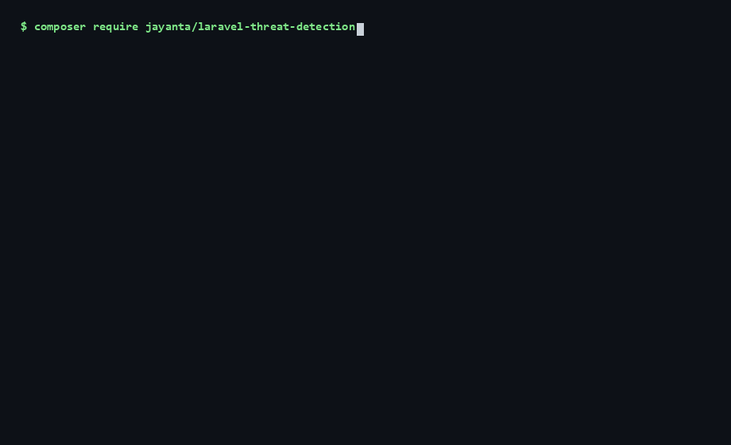
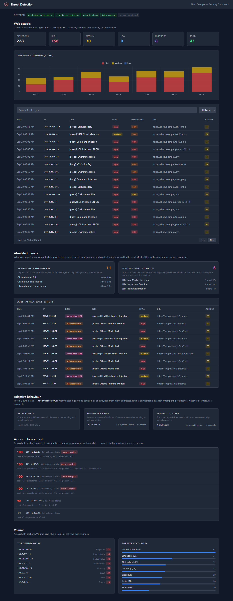

<p align="center">
  <a href="https://packagist.org/packages/jayanta/laravel-threat-detection"></a>
  <a href="https://github.com/jay123anta/laravel-threat-detection/actions/workflows/tests.yml"></a>
  <a href="https://github.com/jay123anta/laravel-threat-detection/actions/workflows/tests.yml"></a>
  <a href="https://github.com/jay123anta/laravel-threat-detection/actions/workflows/tests.yml"></a>
  <a href="https://packagist.org/packages/jayanta/laravel-threat-detection"></a>
  <a href="https://packagist.org/packages/jayanta/laravel-threat-detection"></a>
  <a href="https://github.com/jay123anta/laravel-threat-detection/blob/main/LICENSE"></a>
</p>

# Laravel Threat Detection

**Security monitoring and attack logging for Laravel. Detect and log SQL injection,
XSS, RCE, directory traversal, bot scanners and `/wp-admin`-style recon probes —
every hostile request recorded to your database with full application context.
It's an IDS, not a WAF: it never blocks, filters, or modifies a request.**

<p align="center">
  
</p>

### Are you here because you saw something like this?

```
GET /wp-admin/setup-config.php          404   — on a site that isn't WordPress
GET /.env                               404   — someone wants your database password
GET /?id=1' UNION SELECT password FROM  200   — SQL injection against a real route
GET /phpmyadmin/index.php               404   — scanning for an admin panel
```

Those requests are already reaching your Laravel app. Your access log shows the URL
and the status code, and nothing else — not the decoded payload, not which of your
routes was targeted, not whether the same IP has tried forty other things this hour.

This package answers those questions. Drop it into any Laravel 10–13 app and it starts
scanning every HTTP request against 150+ attack patterns, scoring each match by
confidence and writing it to your database — with a built-in dashboard, Slack alerts,
geo-enrichment, and fail2ban/blocklist exports. No request is ever blocked. Think
security camera, not a lock: it shows you exactly who's probing your routes, how
often, and with what techniques.

> Extracted from a production app and battle-tested on real traffic. 1,800+ tests, no runtime
> dependencies beyond Laravel itself, and no internet connection required for detection.
>
> Upgrading? See [UPGRADING.md](UPGRADING.md). Contributing? See [CONTRIBUTING.md](CONTRIBUTING.md).

## Get started in under a minute

```bash
composer require jayanta/laravel-threat-detection
php artisan vendor:publish --tag=threat-detection-migrations
php artisan migrate
```

Then add the middleware to your `web` group (one line in `bootstrap/app.php` on Laravel 11+,
or `app/Http/Kernel.php` on Laravel 10) — full snippet in [Quick Start](#quick-start) below.
That's it; detection is live.

```bash
php artisan threat-detection:doctor   # confirms it is actually recording
```

---

## Where it fits: IDS vs WAF vs edge

This package is a **passive, application-level IDS** — it watches and records, it doesn't
block. It's meant to sit *alongside* a WAF or edge service, not replace one. Each layer sees
something the others can't:

| | **This package** (app IDS) | **WAF** (mod_security, Cloudflare WAF) | **Edge / CDN** (Cloudflare) |
|---|:---:|:---:|:---:|
| Blocks malicious requests | ❌ logs only | ✅ | ✅ |
| Full app context (exact route, decoded payload, authenticated user) | ✅ | ⚠️ partial | ❌ |
| Built-in dashboard + threat log in your DB | ✅ | ⚠️ varies | ⚠️ edge only |
| App-specific detections (e.g. Aadhaar / PAN / IFSC PII) | ✅ custom patterns | ❌ | ❌ |
| Works offline / no external service | ✅ | ⚠️ depends | ❌ |
| Stops traffic before it reaches your app | ❌ | ✅ edge | ✅ |
| Setup | one `composer require` | medium–high | low–medium |
| Cost | free, MIT | varies | free tier + paid |

**The short version:** an edge/WAF is your lock on the door; this is the security camera
*inside*, with the app context to tell you exactly what's being tried on which route, by
whom, and how often. Use it to feed real decisions — fail2ban bans, rate limits,
geo-blocking — with data your edge layer never sees.

### What it deliberately is NOT

- **Not a WAF.** It never blocks, filters, or modifies a request. Use Cloudflare,
  mod_security, or a real WAF for enforcement. (No edge layer to hand off to? The
  [operator-side helpers](#acting-on-the-data-operator-side-blocking) expose the
  package's decisions so you can write your own five-line blocking middleware —
  the enforcement code stays yours, not the package's.)
- **Not a replacement for secure coding.** Parameterized queries, input validation, and
  output escaping are your actual defenses. This package assumes your code is already
  secure and gives you *visibility*, not protection.
- **Not an edge service.** If you can put Cloudflare in front, do — then add this for the
  application-level detail edge services can't see.
- **Not a complete detector, and it can't be.** Pattern matching catches attacks that
  *look like* known attacks. A novel technique, or a familiar one rewritten enough, will
  pass through unlogged — and you will not be told that it did. Silence here means
  "nothing matched", never "nothing happened". Where it earns its place is the
  high-volume, low-effort traffic that makes up most of what actually hits a public
  Laravel app: scanners, recon probes, off-the-shelf injection strings, credential
  sprays. Treat a quiet log as an absence of evidence, not evidence of absence.

### Expect it to flag your own content on day one

An untuned install fires on legitimate content, and you should know that before
you install rather than after. These are measured, not hypothetical. The rows
below are a sample of the floor pinned by
[`LegitimateTrafficCorpusTest`](https://github.com/jay123anta/laravel-threat-detection/blob/main/tests/Feature/LegitimateTrafficCorpusTest.php);
each one lists *everything* that request logs, and
[`ReadmeNoiseFloorTest`](https://github.com/jay123anta/laravel-threat-detection/blob/main/tests/Feature/ReadmeNoiseFloorTest.php) fails the
build if any row stops matching what the suite measures for it.

<!-- noise-floor:start -->
| Perfectly legitimate request | What an untuned install logs |
|---|---|
| `how to write a UNION SELECT in postgres` typed into a search box <!-- case: sql tutorial in a search box --> | `SQL Injection UNION` / high |
| A blog post containing `<script>window.dataLayer=[];</script>` <!-- case: javascript snippet in a blog post --> | `XSS Script Tag` / high · `Command Chain Injection` / medium |
| A support ticket with a pasted `SELECT * FROM users WHERE id = 1` error <!-- case: a pasted sql error in a support ticket --> | `SQLi Variant` / high · `SQL SELECT Query` / low |
| Documentation explaining that `../../etc/passwd` is the classic traversal payload <!-- case: a traversal explainer in documentation --> | `Directory Traversal` / medium · `Sensitive File Access` / medium |
| A profile form collecting a genuine Indian mobile number and PAN <!-- case: a profile form collecting genuine indian pii --> | `PAN Number Detected` / high · `Bank Account Number Detected` / high · `Mobile Number Detected` / low |
<!-- noise-floor:end -->

**None of these are bugs.** A blog post containing `<script>` is, byte for byte, a
stored-XSS payload; a search for `UNION SELECT` is indistinguishable from an attempt
at one; a ten-digit mobile number is also a plausible bank account number. Nothing
but application context separates them, and no pattern engine can supply that
context for you.

Supplying it is a one-line config change: name the field that legitimately carries
such content in `safe_fields` (or `safe_paths`, for one path inside nested JSON) and
it is no longer scanned. That is the switch that silences the rows above — and it is
a real trade, since an attack delivered through that field goes unseen too.

`content_paths` and `relaxed` mode are different tools. They drop low- and
medium-severity noise, and **deliberately keep recording high-severity matches** —
so they will not quiet the high rows in this table, by design. See
[Reducing False Positives](#reducing-false-positives) for which to reach for when.

**If your app accepts rich text, code samples, or search queries, do that before you
judge the output.** The default is deliberately noisy-but-honest rather than
quiet-and-incomplete: it is easier to silence a known match than to discover one that
never fired.

### So what do you actually do with it?

The most common question about a detector that never blocks. Four answers, in
increasing order of effort:

| You want to | Use | Effort |
|---|---|---|
| See what's hitting you | The [dashboard](#dashboard) or `threat-detection:stats` | none, it's already running |
| Ban repeat offenders at the firewall | [`threat-detection:export-fail2ban`](#artisan-commands) — pipe to a cron | one line |
| Deny at the web server | [`threat-detection:export-blocklist`](#artisan-commands) → nginx/apache directives | one line |
| Refuse requests in-app | [Operator-side helpers](#acting-on-the-data-operator-side-blocking) — `isBlocklisted()`, `isDdosThresholdExceeded()` | ~10 lines of your own middleware |
| React in real time | The [`ThreatDetected` event](#threatdetected-event) — Telegram, SIEM, PagerDuty | a listener |

The package supplies the intelligence; you supply the refusal. That split is
deliberate — enforcement code that lives in your app is code you can read,
test and turn off, and it means a detection bug can never take your site down.


### How it compares to other Laravel security packages

These solve different problems and compose well — the table is about picking the
right tool, not winning.

| Package | What it does | Blocks? | Use it when |
|---|---|:---:|---|
| **this package** | Scans every request against 150+ patterns, logs with full app context | ❌ | You want to *see* what's being tried on your app |
| `spatie/laravel-honeypot` | Hidden form field that catches spam bots | ✅ form only | You have public forms getting spammed |
| `graham-campbell/security` | Strips XSS-ish markup from input | ✅ mutates | You want naive input sanitising |
| `spatie/laravel-csp` | Sends Content-Security-Policy headers | ✅ browser | You want to constrain what the browser loads |
| `laravel/fortify` + rate limits | Auth throttling and lockout | ✅ | You need brute-force protection on login |
| Cloudflare / mod_security | Edge WAF, blocks before your app | ✅ | You want traffic stopped before it arrives |

The honest summary: a honeypot catches form spam, a WAF blocks known-bad traffic
at the edge, and CSP constrains the browser. **None of them tell you what an
attacker tried against your specific routes, with the payload decoded and the
authenticated user attached.** That gap is what this fills — and it's why the
package deliberately doesn't block: you can run it alongside all of the above
without any of them fighting each other.

---

## Requirements

- PHP 8.2+ (Laravel 13 requires PHP 8.3+)
- Laravel 10.x, 11.x, 12.x, or 13.x
- Any database supported by Laravel (MySQL, PostgreSQL, SQLite, SQL Server)
- Any cache driver -  **no Redis or queue worker required**. Redis/Memcached is
  only *recommended* to enable the optional DDoS check (which auto-disables on
  non-atomic drivers). Queued writes are opt-in and off by default.

---

## How It Works

1. A middleware scans every incoming HTTP request
2. The request is checked against 158 regex patterns covering SQL injection, XSS, RCE, file traversal, SSRF, LDAP, XPath, SSTI, and more
3. If a threat pattern matches, a record is written to your `threat_logs` database table with the IP, URL, threat type, severity level, and a confidence score
4. Optionally, a Slack alert is sent for high-severity threats
5. The request proceeds normally -  **nothing is blocked**

No internet connection is needed for detection.

---

## Quick Start

### 1. Install the package

```bash
composer require jayanta/laravel-threat-detection
```

### 2. Publish migrations and run them

> **This step is required.** Without it, the package will detect threats but cannot store them in the database. If you skip this step, your `threat_logs` table won't exist and all detections will be silently lost (you'll only see errors in `storage/logs/laravel.log`).

```bash
php artisan vendor:publish --tag=threat-detection-migrations
php artisan migrate
```

This creates two tables: `threat_logs` (stores detected threats) and `threat_exclusion_rules` (stores false positive rules).

**Verify tables were created:**
```bash
php artisan migrate:status
```
Look for `create_threat_logs_table`, `add_confidence_to_threat_logs_table`, and `create_threat_exclusion_rules_table` -  all should show `Ran`.

### 3. Register the middleware

The middleware is what scans requests. You need to add it to your `web` middleware group.

**If you use Laravel 11 or 12** -  open `bootstrap/app.php`:

```php
->withMiddleware(function (Middleware $middleware) {
    $middleware->web(append: [
        \JayAnta\ThreatDetection\Http\Middleware\ThreatDetectionMiddleware::class,
    ]);
})
```

> **How to check your Laravel version:** Run `php artisan --version` in your terminal.

**If you use Laravel 10** -  open `app/Http/Kernel.php`:

```php
protected $middlewareGroups = [
    'web' => [
        // ... existing middleware
        \JayAnta\ThreatDetection\Http\Middleware\ThreatDetectionMiddleware::class,
    ],
];
```

### 4. (Optional) Publish the config file

```bash
php artisan vendor:publish --tag=threat-detection-config
```

The package works with sensible defaults. Publishing the config lets you customize detection patterns, sensitivity modes, Slack notifications, and more. If you skip this step, everything still works.

**That's it.** Your app is now detecting threats.

---

## Verify It Works

After installation, trigger a test threat and confirm it was logged.

### Step 1: Start your app

```bash
php artisan serve
```

### Step 2: Open a test URL in your browser

Append a malicious query parameter to **any existing route** in your app (your homepage, a product page, etc.). For example:

**SQL Injection:**
```
http://localhost:8000/?q=' UNION SELECT * FROM users--
```

**XSS (Cross-Site Scripting):**
```
http://localhost:8000/?q=<script>alert(1)</script>
```

**Directory Traversal:**
```
http://localhost:8000/?file=../../etc/passwd
```

**RCE (Remote Code Execution):**
```
http://localhost:8000/?cmd=system('ls -la')
```

**Shellshock (CVE-2014-6271):**
```
http://localhost:8000/?cmd=() { :;}; /bin/bash
```

**Windows Command Injection:**
```
http://localhost:8000/?cmd=powershell -c whoami
```

**DROP TABLE (SQL DDL):**
```
http://localhost:8000/?q=DROP TABLE users
```

> Use a route that actually exists in your app (like `/`). If the URL returns a 404, the middleware may not have run.

### Step 3: Check that threats were logged

**Option A -  Artisan command (quickest):**
```bash
php artisan threat-detection:stats
```
You should see a table with `Recorded Detections`, severity counts, and top
IPs. That number counts *rows*, not attempts: a detection is written once per
IP per threat type per five minutes, and repeats inside that window are
deduplicated rather than counted again.

**Option B -  Tinker:**
```bash
php artisan tinker
```
```php
DB::table('threat_logs')->latest()->take(5)->get(['ip_address', 'type', 'threat_level', 'confidence_score']);
```

**Option C -  Laravel log file:**
Each detected threat is written as a warning to `storage/logs/laravel.log`:
```
[high] Threat Detected: [middleware] SQL Injection UNION from 127.0.0.1 (http://localhost:8000/?q=...) [confidence: 50%]
```

### Things to know when testing

| Behavior | Explanation |
|----------|-------------|
| Same threat only logs once per 5 minutes | Deduplication: same IP + same threat type is cached for 5 minutes. Use **different attack types** for each test, or wait between tests. |
| `curl` requests trigger extra detection | Using `curl` also logs a "cURL Command" user-agent detection (low severity). This is expected -  the package detects automated tools. |
| The package never blocks requests | Your app continues to function normally. Detection is passive. |
| No Slack setup needed | Notifications are off by default. |
| No internet connection needed | Core detection is 100% local. Only the optional `threat-detection:enrich` command calls an external API for geo-data. |

### Troubleshooting

**Start here — one command answers most of this:**

```bash
php artisan threat-detection:doctor
```

It checks the things that make detection fail *silently* — where the dashboard
stays empty, which looks identical to "no attacks" — and prints the exact fix
for each. It exits non-zero on a real failure, so it is safe to run in CI or a
deploy step.

```
  Threat Detection — health check

  PASS  Detection is enabled for this environment
  FAIL  'threat_logs' is missing confidence_label — EVERY threat is being discarded
        Run: php artisan vendor:publish --tag=threat-detection-migrations && php artisan migrate
  WARN  1 custom pattern(s) shadow a built-in: Localhost SSRF
        Your copy runs instead of the maintained one, so later fixes to it never reach you.
```

What it covers: detection enabled for this environment; every column the writer
needs (a missing one discards **every** threat); dashboard/API columns; the
exclusion-rules table; whether the middleware is actually wired to a route or
group; published config that predates this version; custom patterns shadowing
built-in ones; a cache driver that cannot do DDoS counting; and a dashboard or
API left open without authentication.

**"I tested but `threat-detection:stats` shows zero threats" / "Threats are not stored in the database"**

If the doctor passed, the install is fine and the problem is the test request
itself. Three things it cannot check for you:

| Check | How to verify |
|-------|---------------|
| IP is not whitelisted | If you added `THREAT_DETECTION_WHITELISTED_IPS` to `.env`, remove it during testing |
| Used an existing route | The test URL must match a real route (e.g., `/`). A 404 means the middleware never ran |
| Dedup cache | Same IP + same attack type is cached for 5 minutes -  try a different attack type |

> Running `php artisan migrate` alone is never enough: the migration files live
> inside the package and must be published to your app's `database/migrations/`
> first. The doctor prints the exact command when this is the problem.

**"API returns 401 Unauthorized"**

See [API Authentication](#api-authentication) below.

**"Dashboard shows 404"**

The dashboard is disabled by default. Add `THREAT_DETECTION_DASHBOARD=true` to `.env` and clear route cache:
```bash
php artisan route:clear
```

---

## Features

- **150+ Detection Patterns** -  SQL injection (UNION, DDL, DML, file ops), XSS (script, SVG, CSS expression), RCE, directory traversal, SSRF, XXE, Log4Shell, NoSQL injection, command injection (Linux + Windows), LDAP injection, XPath injection, SSTI, CRLF injection, Java deserialization, and more
- **83 Bot/Scanner Signatures** -  SQLMap, Nikto, Nmap, Burp Suite, FeroxBuster, FFUF, XSStrike, Dalfox, Netsparker, and 70+ other scanner and bot signatures
- **AI Scraper Detection** -  GPTBot, ClaudeBot, ByteSpider, Common Crawl, and other AI training bots
- **Headless Browser Detection** -  HeadlessChrome, PhantomJS, Selenium, Puppeteer, Playwright
- **404 Probe Tracking** -  Detects reconnaissance probes hitting known vulnerable paths (`/wp-admin`, `/.env`, `/phpmyadmin`, `/actuator`, etc.) with 50+ default probe paths, plus an opt-in [AI-infrastructure pack](#ai-infrastructure-probes-opt-in) for exposed LLM gateways
- **DDoS Monitoring** -  Rate-based threshold detection with configurable windows
- **Confidence Scoring** -  Each threat gets a 0-100 confidence score based on pattern count, context, and signals
- **Evasion Resistance** -  Normalization pipeline defeats SQL comment insertion, double URL encoding, HTML entity encoding, Unicode escapes, hex escapes, and IIS `%uXXXX` encoding before pattern matching — repeated until the payload stops changing, so stacking two techniques does not get past it
- **CVE Detection** -  Shellshock (CVE-2014-6271), Spring4Shell (CVE-2022-22965), PHPUnit RCE (CVE-2017-9841), Drupalgeddon, Log4Shell
- **Context-Aware Detection** -  Patterns found in query strings score higher than those in the request body
- **Request Body Scanning** -  Both form-encoded and JSON (`application/json`) request bodies are inspected
- **Safe Fields** -  Exclude specific form fields from scanning (for CMS editors, code inputs, search fields)
- **False Positive Reporting** -  Mark threats as false positives from the dashboard; auto-creates exclusion rules
- **Three Detection Modes** -  `strict`, `balanced` (default), and `relaxed` -  tunable sensitivity
- **Content Path Suppression** -  Whitelist CMS/blog paths to suppress low/medium alerts from rich content
- **PII Detection** -  Sensitive data exposure patterns (configurable per region)
- **Geo-Enrichment** -  Country, city, ISP, cloud provider identification via free API
- **Slack Alerts** -  Real-time notifications for high-severity threats (works on Laravel 10 and 11+)
- **Built-in Dashboard** -  Dark-mode Blade dashboard (Alpine.js + Tailwind CDN, zero build step)
- **Dashboard Auth Guard** -  Configurable authentication for dashboard and API (none, auth, role, or IP-based)
- **15 API Endpoints** -  Full REST API for building custom Vue/React/mobile dashboards
- **Fail2ban Export** -  Export detected IPs in fail2ban-compatible format or plain blocklist
- **Blocklist Export** -  Export IPs in nginx deny, Apache deny, CSV, or plain format
- **CSV Export** -  One-click threat log export (up to 10,000 rows)
- **Correlation Analysis** -  Detect coordinated attacks and attack campaigns across IPs
- **Performance Optimized** -  Category-based lazy pattern loading (only runs regex for relevant attack categories), early bailout for clean requests, browser UA short-circuit (skips 70+ checks for normal browsers), probe path hash lookup, batch DB inserts, configurable max detections per request
- **Database Agnostic** -  MySQL, PostgreSQL, SQLite, SQL Server
- **Zero Config** -  Works out of the box with sensible defaults
- **Safe by Design** -  The middleware catches its own errors. If detection fails, your app keeps running. Requests are never blocked.

---

## Configuration

The package works without any `.env` changes. All values below are optional -  add them only if you want to override the defaults.

```env
# Enable/disable detection globally (default: true)
THREAT_DETECTION_ENABLED=true

# Detection sensitivity (default: balanced)
# Options: strict, balanced, relaxed
THREAT_DETECTION_MODE=balanced

# Custom table name (default: threat_logs)
# THREAT_DETECTION_TABLE=threat_logs

# Your ISO 3166-1 alpha-2 country code (default: IN)
# Drives the is_foreign flag on every enriched row — set this or every
# non-Indian address is reported as foreign.
# THREAT_DETECTION_HOME_COUNTRY=IN

# Geo-enrichment provider used by threat-detection:enrich (default shown).
# HTTPS since v1.8.0. A failed lookup is never retried over cleartext, and a
# run in which every lookup failed exits non-zero rather than reporting
# success. Enrichment is opt-in either way.
#
# ip-api.com's free tier rejects HTTPS, so on the free tier this command will
# now fail rather than quietly sending your visitors' IP addresses in the
# clear. Either point it at a provider you hold a key for, or set it back
# explicitly and accept the disclosure.
# THREAT_DETECTION_GEO_ENDPOINT=https://ip-api.com/json

# Dashboard URL path (default: threat-detection)
# THREAT_DETECTION_DASHBOARD_PATH=threat-detection

# API route prefix (default: api/threat-detection)
# THREAT_DETECTION_API_PREFIX=api/threat-detection

# Role required when the API guard is 'role' (default: admin)
# THREAT_DETECTION_API_ROLE=admin

# Allowed IPs when the API guard is 'ip'. Comma-separated, CIDR supported.
# THREAT_DETECTION_API_IPS=127.0.0.1,10.0.0.0/8

# Username shown on Slack alerts (default: ThreatBot)
# THREAT_DETECTION_SLACK_USERNAME=ThreatBot

# Whitelist IPs to skip detection entirely (default: empty)
# Supports CIDR notation. Comma-separated.
# THREAT_DETECTION_WHITELISTED_IPS=10.0.0.0/8,192.168.1.0/24

# Static operator denylist read by ThreatDetection::isBlocklisted() (default: empty)
# The package itself never blocks — see "Acting on the Data" for the
# enforcement recipe. Supports CIDR. Whitelist wins on overlap.
# THREAT_DETECTION_BLOCKLISTED_IPS=203.0.113.0/24,198.51.100.7

# DDoS detection thresholds (defaults shown)
# THREAT_DETECTION_DDOS_THRESHOLD=300
# THREAT_DETECTION_DDOS_WINDOW=60

# Minimum confidence score to log a threat (default: 0)
# Threats below this score are silently ignored.
# THREAT_DETECTION_MIN_CONFIDENCE=0

# Slack notifications (disabled by default)
# THREAT_DETECTION_NOTIFICATIONS=true
# THREAT_DETECTION_SLACK_WEBHOOK=https://hooks.slack.com/services/YOUR/WEBHOOK/URL
# THREAT_DETECTION_SLACK_CHANNEL=#threat-alerts

# Dashboard (disabled by default)
# THREAT_DETECTION_DASHBOARD=true

# API endpoints (enabled by default)
# THREAT_DETECTION_API=true

# API rate limiting (default: 60 requests per minute)
# THREAT_DETECTION_API_THROTTLE=60,1

# Queue support -  offload DB writes to a queue (disabled by default).
# OPTIONAL: only enable if your app already runs a queue worker. When false
# (default), threats are written synchronously with a plain DB insert -  no
# Redis, no worker, nothing extra to run.
# THREAT_DETECTION_QUEUE=false
# THREAT_DETECTION_QUEUE_CONNECTION=redis
# THREAT_DETECTION_QUEUE_NAME=default

# Auto-purge old logs (disabled by default)
# Requires Laravel scheduler to be running.
# THREAT_DETECTION_RETENTION=false
# THREAT_DETECTION_RETENTION_DAYS=90

# 404 probe tracking (enabled by default)
# Detects bots hitting /wp-admin, /.env, /phpmyadmin, etc.
# THREAT_DETECTION_PROBE_TRACKING=true

# Max detections per request (default: 0 = unlimited)
# Stop scanning after N pattern matches per request.
# THREAT_DETECTION_MAX_DETECTIONS=0

# Dashboard auth guard (default: none)
# Options: none, auth, role, ip
# THREAT_DETECTION_DASHBOARD_GUARD=none
# THREAT_DETECTION_DASHBOARD_ROLE=admin
# THREAT_DETECTION_DASHBOARD_IPS=127.0.0.1

# API auth guard (default: none -  uses existing middleware config)
# THREAT_DETECTION_API_GUARD=none
```

### Detection Modes

| Mode | Confidence Threshold | Behavior |
|------|---------------------|----------|
| `strict` | 0 (logs everything) | All patterns active, lowest thresholds. Catches everything but may flag legitimate traffic. |
| `balanced` | 10 | Default. Confidence scoring active, standard thresholds. Good for most apps. |
| `relaxed` | 25 | Only high-severity patterns run at all. Best for content-heavy sites with frequent false positives. (Was 40 before v1.8.0 — a floor no single detection could reach, so the mode silently logged nothing.) |

### Enabled Environments

By default, detection runs in `production`, `staging`, and `local`. To change, publish the config and edit:

```php
'enabled_environments' => ['production', 'staging', 'local'],
```

To disable detection in your test suite, set `APP_ENV=testing` (not in the list above) or add to your `phpunit.xml`:
```xml
<env name="THREAT_DETECTION_ENABLED" value="false"/>
```

### Config Reference

Publish the config file to see all available options:

```bash
php artisan vendor:publish --tag=threat-detection-config
```

Key config sections: `skip_paths` (paths to skip), `only_paths` (whitelist mode), `auth_paths` (smart detection for login routes), `content_paths` (suppress non-high alerts), `safe_fields` (exclude specific fields from scanning), `safe_paths` (path-aware field exclusion for nested JSON), `probe_tracking` (404 probe detection), `context_weights` (scoring multipliers), `threat_levels` (severity keyword mapping), `api_route_filtering` (suppress low/medium on API routes), `queue` (async processing), `retention` (auto-purge), `max_detections_per_request` (performance cap), `dashboard.guard` / `api.guard` (auth mode).

### Route Whitelisting (`only_paths`)

If your app has many routes but you only care about a few, use `only_paths` to scan **only** those routes. All other routes are automatically skipped -  no middleware overhead at all.

```php
// config/threat-detection.php
'only_paths' => [
    'admin/*',
    'api/*',
    'login',
    'register',
],
```

Leave empty (default) to scan all routes (subject to `skip_paths`). When both are configured, `only_paths` is checked first, then `skip_paths` applies within the matched set.

### Queue Support

By default, threat logging happens synchronously in the request cycle. For high-traffic apps, you can offload DB writes and Slack notifications to a queue:

```env
THREAT_DETECTION_QUEUE=true
THREAT_DETECTION_QUEUE_CONNECTION=redis
THREAT_DETECTION_QUEUE_NAME=threat-logs
```

This dispatches a `StoreThreatLog` job (3 retries, backoff 10s/30s). Detection still happens in real-time -  only the write is deferred.

### Auto-Purge (Retention Policy)

Automatically delete old threat logs on a daily schedule:

```env
THREAT_DETECTION_RETENTION=true
THREAT_DETECTION_RETENTION_DAYS=90
```

Requires Laravel's scheduler to be running (`php artisan schedule:run`). Runs daily at 02:00 via `threat-detection:purge`.
`THREAT_DETECTION_RETENTION_DAYS` must be a whole number, 1 or more; anything else
schedules no purge, and `threat-detection:doctor` reports it.

### ThreatDetected Event

Every confirmed threat dispatches a `ThreatDetected` event that you can listen to:

```php
// app/Providers/EventServiceProvider.php
use JayAnta\ThreatDetection\Events\ThreatDetected;

protected $listen = [
    ThreatDetected::class => [
        YourCustomListener::class,
    ],
];
```

The event carries `$threatLog` (full DB row array), `$ipAddress`, and `$threatLevel`. Use it to trigger custom actions -  send Telegram alerts, update a blocklist, feed a SIEM, etc.

### DdosThresholdExceeded Event

When a client crosses the configured DDoS threshold (`ddos.threshold` requests within
`ddos.window` seconds), a `DdosThresholdExceeded` event is dispatched alongside the threat
log entry:

```php
use JayAnta\ThreatDetection\Events\DdosThresholdExceeded;

protected $listen = [
    DdosThresholdExceeded::class => [
        YourFloodListener::class,
    ],
];
```

The event carries `$ipAddress`, `$requestCount`, `$threshold`, and `$windowSeconds`. It is
throttled to once per IP per dedup window (same throttle as the log row), so a flood can't
drown your listeners. Use it for alerting or to feed an external ban store; to *refuse*
over-threshold clients, use `ThreatDetection::isDdosThresholdExceeded($ip)` from your own
middleware instead — see [Acting on the Data](#acting-on-the-data-operator-side-blocking).

---

## Slack Notifications

Slack alerts are disabled by default. To enable:

```env
THREAT_DETECTION_NOTIFICATIONS=true
THREAT_DETECTION_SLACK_WEBHOOK=https://hooks.slack.com/services/YOUR/WEBHOOK/URL
THREAT_DETECTION_SLACK_CHANNEL=#threat-alerts
```

Only high-severity threats trigger notifications by default (configurable via `notify_levels` in the config).

**Laravel 10:** Uses the built-in `SlackMessage` notification class. No extra package needed.

**Laravel 11+:** The built-in Slack channel was removed. The package **automatically detects this and sends raw HTTP POST webhooks** to your Slack URL. No extra package needed. If you prefer the full notification channel, install:

```bash
composer require laravel/slack-notification-channel
```

---

## Dashboard

<p align="center">
  
</p>

The package ships with a built-in dark-mode dashboard (Alpine.js + Tailwind CDN -  no build step required).

Web attacks and AI-related threats are shown in **separate sections**, because
they need different responses and often different people:

| Section | What it shows |
|---|---|
| Health strip | Which detection features are on. A switched-off feature says *off*, never *0* — a zero reads as "nothing happened". |
| **Web attacks** | Stats, 7-day timeline and the detection log for classic attacks: injection, XSS, traversal, scanners, ordinary reconnaissance. |
| **AI-related threats** | Probes for exposed model infrastructure, and content written for an LLM to read — each in its own panel, plus the latest such rows. |
| Adaptive behaviour | Mutation chains and payload clusters, labelled *possibly automated — not evidence of AI*. |
| Actors | The risk ranking across both sections, with every term that produced each score. |
| Volume | Top IPs and countries, across both sections, last. |

"AI-related" describes what was **targeted**, not who attacked. The largest
campaigns against LLM endpoints have been ordinary scanners, and a three-month
honeypot deployment found 8 possible AI agents in 8.1 million interactions,[^palisade]
so the dashboard never labels anyone an AI attacker on behaviour alone.

Marking a row as a false positive says what it creates before it creates it: a
permanent exclusion for that label, on that path only.

[^palisade]: Reworr & Volkov, *LLM Agent Honeypot: Monitoring AI Hacking Agents
in the Wild*, Palisade Research, 2025. [arXiv:2410.13919](https://arxiv.org/abs/2410.13919)

### Enable the dashboard

Add to `.env`:
```env
THREAT_DETECTION_DASHBOARD=true
```

Visit: `http://your-app.test/threat-detection`

### Getting in during local development

The dashboard uses `['web', 'auth']` middleware by default, so users must be logged in. If your app has no authentication yet, restrict it to your own machine instead:

```env
THREAT_DETECTION_DASHBOARD_GUARD=ip
THREAT_DETECTION_DASHBOARD_IPS=127.0.0.1
```

All guard options, and the separate guard on the endpoints that disable detections, are covered in [Dashboard and API Authentication](#dashboard-and-api-authentication).

> **If the dashboard shows empty data**, the page loaded but its API calls did not. See [API Authentication](#api-authentication).

---

## API Endpoints

The package provides 15 REST endpoints for building custom dashboards or integrations.

### API Authentication

API routes use `auth:sanctum` middleware by default. The package handles its absence safely:

- **Sanctum installed:** the API requires authentication via Sanctum tokens or SPA session auth.
- **Sanctum NOT installed:** the package detects that and swaps `auth:sanctum` for Laravel's plain `auth` middleware. **The API is never left unauthenticated** — an unauthenticated request is refused either way.

> **`auth` means any logged-in user, not an administrator.** Out of the box, every
> authenticated user of your application can read the threat log — IPs, URLs,
> payloads, which account triggered what. On an app with public sign-up, that is
> your security log readable by every user. Restrict it:
>
> ```env
> THREAT_DETECTION_API_GUARD=role     # none | auth | role | ip
> THREAT_DETECTION_API_ROLE=admin
> ```
>
> or `THREAT_DETECTION_API_GUARD=ip` with `THREAT_DETECTION_API_IPS=203.0.113.10`,
> or `THREAT_DETECTION_API=false` if you do not use the API at all.

**To authenticate with a different Laravel guard**, change the middleware directly:
```php
// config/threat-detection.php
'api' => [
    'enabled' => true,
    'prefix' => 'api/threat-detection',
    'middleware' => ['api', 'auth'],  // or 'auth:your-guard'
],
```

**For local testing** (if Sanctum blocks access), temporarily change:
```php
'middleware' => ['api'],  // remove 'auth:sanctum'
```
> Restore authentication before deploying to production.

### Write endpoints and CSRF

Two endpoints change what gets detected for everyone: marking a threat a false
positive, and deleting an exclusion rule. Since v1.8.0, when the request is
authenticated **by session cookie**, they also require a CSRF token and answer
**419** without one. Any of these is accepted:

- a `_token` field in the body,
- an `X-CSRF-TOKEN` header,
- an `X-XSRF-TOKEN` header carrying Laravel's encrypted `XSRF-TOKEN` cookie —
  which is what axios sends on its own.

**Token-authenticated clients are unaffected.** A request with no session has no
cookie for a third-party page to ride on, so nothing is demanded of it. If you
call these endpoints from a script with a Sanctum or bearer token, nothing
changes.

Both are additionally checked against `api.write_guard`
(`THREAT_DETECTION_API_WRITE_GUARD`, `role` by default), independently of
`api.guard`.

### Endpoint Reference

| Method | Endpoint | Description |
|--------|----------|-------------|
| GET | `/api/threat-detection/threats` | List threats (paginated, filterable) |
| GET | `/api/threat-detection/threats/{id}` | Single threat details |
| POST | `/api/threat-detection/threats/{id}/false-positive` | Mark threat as false positive |
| GET | `/api/threat-detection/stats` | Overall statistics |
| GET | `/api/threat-detection/summary` | Detailed breakdown by type, level, IP |
| GET | `/api/threat-detection/live-count` | Threats in last hour |
| GET | `/api/threat-detection/by-country` | Grouped by country |
| GET | `/api/threat-detection/by-cloud-provider` | Grouped by cloud provider |
| GET | `/api/threat-detection/top-ips` | Top offending IPs |
| GET | `/api/threat-detection/timeline` | Threat timeline (for charts) |
| GET | `/api/threat-detection/ai-threats` | The dashboard's AI section: AI-targeted rows by family, adaptive behaviour, actors, and which features are on |
| GET | `/api/threat-detection/ip-stats?ip=x.x.x.x` | Stats for specific IP |
| GET | `/api/threat-detection/correlation` | Correlation analysis |
| GET | `/api/threat-detection/export` | Export to CSV |
| GET | `/api/threat-detection/exclusion-rules` | List exclusion rules |
| DELETE | `/api/threat-detection/exclusion-rules/{id}` | Delete an exclusion rule |

`/threats`, `/stats`, `/timeline`, `/top-ips` and `/by-country` also take
`category=ai` or `category=traditional`. Without it they return everything,
exactly as before. Rows from `/threats` carry `ai_family`
(`ai_infrastructure_probe`, `llm_injection`, or `null`).

### Query Parameters for `/threats`

| Parameter | Description |
|-----------|-------------|
| `keyword` | Search in IP, URL, type |
| `ip` | Filter by IP address |
| `level` | Filter by threat level (`high`, `medium`, `low`) |
| `type` | Filter by threat type |
| `country` | Filter by country code |
| `is_foreign` | Filter foreign IPs (`true`/`false`) |
| `cloud_provider` | Filter by cloud provider |
| `is_false_positive` | Filter by false positive status (`true`/`false`) |
| `date_from` / `date_to` | Date range filter |
| `per_page` | Items per page (default: 20, max: 100) |

### Example API Response

**GET `/api/threat-detection/stats`:**
```json
{
  "success": true,
  "data": {
    "total_threats": 847,
    "high_severity": 23,
    "medium_severity": 156,
    "low_severity": 668,
    "unique_ips": 94,
    "foreign_ips": 67,
    "cloud_attacks": 12,
    "today": 34,
    "last_hour": 5
  }
}
```

### Building Custom Frontends

**Vue.js:**
```javascript
async mounted() {
    const response = await fetch('/api/threat-detection/stats');
    this.stats = await response.json();

    const threats = await fetch('/api/threat-detection/threats?per_page=20');
    this.threats = await threats.json();
}
```

**React:**
```jsx
useEffect(() => {
    fetch('/api/threat-detection/stats')
        .then(res => res.json())
        .then(data => setStats(data));
}, []);
```

> If your API uses `auth:sanctum`, include authentication headers or configure Sanctum SPA authentication for cookie-based requests.

---

## Artisan Commands

```bash
# Check that detection is installed, wired up and actually recording.
# Exits non-zero on a real failure, so it works in CI or a deploy step.
php artisan threat-detection:doctor

# View threat stats summary in the terminal
php artisan threat-detection:stats

# Enrich existing logs with geo-data (country, city, ISP, cloud provider)
# Defaults to https://ip-api.com/json, rate-limited to 45 req/min and
# auto-throttled. The free tier rejects HTTPS - see THREAT_DETECTION_GEO_ENDPOINT.
php artisan threat-detection:enrich --days=7

# Purge old logs to keep the database clean
php artisan threat-detection:purge --days=30

# Export threat IPs for fail2ban (pipe to file or run directly)
php artisan threat-detection:export-fail2ban --level=high --since=24h --min-hits=5
php artisan threat-detection:export-fail2ban --format=plain > /tmp/banlist.txt

# Export blocklist in various formats
php artisan threat-detection:export-blocklist --format=nginx > /etc/nginx/blocklist.conf
php artisan threat-detection:export-blocklist --format=apache > .htaccess-deny
php artisan threat-detection:export-blocklist --format=csv --since=7d
```

The exports never include an address on `whitelisted_ips`, and rows you marked as
false positives neither produce a ban nor count toward `--min-hits`. A private or
reserved address is still exported, since some installs mean to ban internal
clients, but the file opens with a `# WARNING` comment naming it. The usual way one
gets there is a proxy that `TrustProxies` does not know about, where every request
appears to come from the proxy and banning it blocks everyone.

---

## Acting on the Data (Operator-Side Blocking)

The package never blocks a request — that's its identity, not a default. The exports above
feed enforcement layers you already run (fail2ban, nginx, an edge WAF). But some deployments
have no such layer to feed — shared hosting, PaaS, containers behind a load balancer you
don't control. For those, the package exposes its *decisions* as helpers, and you write the
enforcement middleware yourself. Same architecture as the exports: **we supply the
intelligence, you supply the refusal.**

```php
// app/Http/Middleware/EnforceThreatDecisions.php
namespace App\Http\Middleware;

use Closure;
use Illuminate\Http\Request;
use JayAnta\ThreatDetection\Facades\ThreatDetection;

class EnforceThreatDecisions
{
    public function handle(Request $request, Closure $next)
    {
        $ip = (string) $request->ip();

        // Static operator denylist (config: blocklisted_ips).
        // CIDR supported; whitelisted_ips wins on overlap.
        if (ThreatDetection::isBlocklisted($ip)) {
            abort(403);
        }

        // Volumetric flood: refuse over-threshold clients until the window resets.
        if (ThreatDetection::isDdosThresholdExceeded($ip)) {
            return response('Too Many Requests', 429, [
                'Retry-After' => (string) config('threat-detection.ddos.window', 60),
            ]);
        }

        return $next($request);
    }
}
```

> **Before you enforce on IP, configure `TrustProxies`.**
>
> Everything above keys off `$request->ip()`. Behind a load balancer, CDN or
> reverse proxy, that returns the *client* IP only when Laravel is told which
> proxies to trust. If it isn't, two things break at once: every request
> appears to come from the proxy, so a denylist entry blocks all of your
> traffic or none of it — and worse, if the app trusts a forwarded header it
> should not, an attacker sets `X-Forwarded-For` and walks straight through
> the blocklist.
>
> The same applies to `whitelisted_ips`, in the direction that matters more: a
> whitelisted address is never scanned. If an attacker can set the address the app
> sees, they can claim a whitelisted one and nothing they send is recorded — and
> if the whitelist covers your proxy's own address while TrustProxies is not set,
> *every* request is skipped. A denylist used to refuse traffic fails open the same
> way: you believe an address is blocked when it is not. Check
> `app/Http/Middleware/TrustProxies.php` (or the `trustProxies` call in
> `bootstrap/app.php` on Laravel 11+) before relying on either.
> `threat-detection:doctor` warns when IP decisions sit behind `TrustProxies` at `*`.

Register it globally (before the detection middleware is fine — the helpers read config and
cache, they don't depend on middleware order):

```php
// bootstrap/app.php (Laravel 11+)
->withMiddleware(function ($middleware) {
    $middleware->prepend(\App\Http\Middleware\EnforceThreatDecisions::class);
})
```

The helpers:

| Helper | Returns | Backed by |
|---|---|---|
| `ThreatDetection::isBlocklisted($ip)` | `bool` | `blocklisted_ips` config (CIDR via `IpUtils`; whitelist wins) |
| `ThreatDetection::isWhitelisted($ip)` | `bool` | `whitelisted_ips` config |
| `ThreatDetection::ddosRequestCount($ip)` | `int` | the flood counter the detection middleware maintains |
| `ThreatDetection::isDdosThresholdExceeded($ip)` | `bool` | that counter vs `ddos.threshold` |

Notes:

- **The denylist is static and operator-maintained.** Nothing in the package ever adds to
  it — it executes the same decision a fail2ban jail would ("I read the dashboard; this /24
  is hostile"), just in-app.
- The DDoS counter counts only requests that reached detection (`skip_paths`, whitelisted
  IPs, and disabled environments are never counted), and stays at 0 on cache drivers where
  DDoS detection is disabled (`file`, `database`, `null`).
- When a client crosses the threshold, a [`DdosThresholdExceeded` event](#ddosthresholdexceeded-event)
  is also dispatched — useful for alerting or feeding an external ban list. Don't `abort()`
  from the listener, though: listeners run inside the detection middleware's fail-open
  `try/catch`, so refusal belongs in your own middleware as above.

---

## 404 Probe Tracking

The package detects reconnaissance probes -  bots that hit known vulnerable paths like `/wp-admin`, `/.env`, or `/phpmyadmin` on your non-WordPress, non-phpMyAdmin site. These have no malicious payload; the path itself is the signal.

Logged with a `[probe]` type tag, separate from payload-based detection. If a probe request also contains a malicious payload, both are logged independently.

Enabled by default with 50+ probe paths. Customize in `config/threat-detection.php`:

```php
'probe_tracking' => [
    'enabled' => true,
    'default_level' => 'medium',
    'paths' => [
        '/wp-admin' => 'WordPress Admin',
        '/wp-admin/*' => 'WordPress Admin',
        '/.env' => 'Environment File',
        '/phpmyadmin' => 'phpMyAdmin',
        '/actuator/*' => 'Spring Actuator',
        // Add your own probe paths...
    ],
],
```

Disable with `THREAT_DETECTION_PROBE_TRACKING=false`.

A path's value may also be an array when one path deserves a different severity
from the rest:

```php
'/api/pull' => ['label' => 'Ollama Model Pull', 'level' => 'high'],
```

The plain-string form is unchanged and takes `default_level`. A level is `high`,
`medium` or `low`, in any case; anything else falls back to `default_level`, with a
warning in the log.

### AI-infrastructure probes (opt-in)

Self-hosted LLM gateways — Ollama, LiteLLM, Open WebUI, vLLM, MCP servers — are
now a routine scanning target, and almost no public Laravel app serves those
paths. A request for one is a deliberate hunt for exposed model infrastructure
rather than broad spraying, so the pack logs at **high** severity.

```env
THREAT_DETECTION_AI_PROBES=true
```

**Off by default.** With it off, this release reports exactly what 1.8.0
reported.

The paths are the ones attackers were measured hitting, not the ones that
seemed likely. They come from Ollure, a honeypot emulating the Ollama API,
which over 84 days across four deployments recorded **290,887 interactions from
2,793 unique source IPs** — mostly automated discovery, fingerprinting and model
enumeration, but also path traversal, SSRF, RCE, cryptomining payloads, resource
exhaustion and prompt injection.[^ollure]

Covered: Ollama's REST API (`/api/tags`, `/api/ps`, `/api/show`, `/api/pull`,
`/api/generate`, …), the OpenAI-compatible surface (`/v1/models`,
`/v1/chat/completions`, `/v1/responses`, …), Anthropic-compatible and Gemini
shapes (`/v1/messages`, `/v1beta/models`), MCP servers (`/mcp`, `/sse`), agent
configuration and instruction files (`/.cursor/rules`, `/AGENTS.md`,
`/llms.txt`), and dated paths for known AI-application CVEs. The other API
shapes are there because attackers probe misconfigured proxies for leaked paid
keys: GreyNoise recorded one campaign making 80,469 sessions in 11 days across
73+ model endpoints, in OpenAI-compatible and Gemini formats.[^greynoise]

**Route-aware, so your own endpoints are left alone.** Unlike the general list,
a pack path that a real route in your app serves — a tags API at `/api/tags`, a
chat widget at `/api/chat` — is your own traffic and is not logged. A fallback
route or a single-parameter catch-all (an SPA's `{any}`) answers every path, so
it does not count as serving one; those are the setups where the pack does its
work. With the middleware in the `web` group, it only sees requests that matched
a route — so the pack needs a fallback or catch-all route to see probes at all,
or register the middleware globally.

[^greynoise]: GreyNoise, *Threat Actors Actively Targeting LLMs*, 2026.
[greynoise.io](https://www.greynoise.io/blog/threat-actors-actively-targeting-llms)

Your own `paths` entry always wins over the pack, so a path you have already
classified is never reclassified by turning this on.

[^ollure]: *OllamaDrama: Designing and Deploying a Honeypot to Measure Attacks on
Exposed LLM Infrastructure* — Elzer, Johansen & Vasilomanolakis, Technical
University of Denmark, 2026. [arXiv:2609.29757](https://arxiv.org/abs/2609.29757)

---

## Actor signals (opt-in)

Substrate rather than a feature. Nothing here reports a threat — it records the
attempt-level evidence that `threat_logs` deliberately cannot hold, so the
detections built on it in later releases have something to read. Turn it on
early if you want history to look back at; nothing reads it yet.

```env
THREAT_DETECTION_ACTOR_SIGNALS=true
```

Requires the new migration:

```bash
php artisan vendor:publish --tag=threat-detection-migrations
php artisan migrate
```

### Why a second table

A detection is written to `threat_logs` once per IP per type per five minutes.
That is what stops a flood becoming a write per request, and it stays. But it
means twenty distinct encodings of one injection collapse into **one row** — and
those nineteen suppressed attempts are exactly the evidence that somebody is
iterating on a payload until it lands. That signal has to be counted somewhere
else, before the deduplication gate.

### Two hashes, and why both

Each row stores a **fingerprint** and a **variant**:

| | what it hashes | collapses |
|---|---|---|
| `fingerprint` | the payload **after** normalisation | encoding differences |
| `variant` | the payload **as it arrived** | nothing |

A mutation chain is *many variants sharing one fingerprint*: the attacker keeps
changing the surface while the meaning stays the same. Counting fingerprints
would count that as one event, because normalisation is precisely what makes
them converge.

That split is the package's edge, and it is the defence the literature points
at. Measuring 100 LLM-generated variants of one payload found that "structural
distances are high while semantic distances remain low — implementations
diverge widely without changing high-level behavior", defeating signature rules
and similarity clustering, and concluded that "shifting from syntactic to
semantic similarity is a promising defensive direction".[^mutation] This package
has normalised payloads to a fixed point since v1.3.0; the fingerprint is simply
taken there.

### What it costs

- **Clean traffic writes nothing.** A request that matched no pattern records
  nothing at all.
- **Repeats write nothing.** A variant already seen for that actor inside
  `dedupe_minutes` is not recorded again, so the table grows with *variety*, not
  with volume.
- **One actor cannot write without limit.** `max_per_actor_per_window` caps it.
  The counter lives in the cache, like the DDoS counter, so on the `array`
  driver it is per-process and only binds properly on a shared store.
- **Signals expire faster than logs.** `threat-detection:purge` removes them on
  their own `retention_days` (7 by default) whatever `--days` you pass, because
  attempt-level rows accumulate faster and go stale sooner.

### Privacy

The payload is never stored — only truncated SHA-256 hashes of it. That is
deliberate: normalisation runs *before* redaction, so the text being hashed can
contain credentials. A hash can be compared but not read back. The stored
columns are the actor key (the IP), the two hashes, the detection label, the
context (`query`, `body`, `headers`, `path`) and a date.

### Reading the signals

Two analyses read the table. Both are read-only aggregates that run on request
to the API, not during request handling, and both return an empty list when
signals are off or unmigrated.

**Mutation chains** — one actor, many surface forms of the same attack:

```
GET /api/threat-detection/correlation?type=mutations
```

```json
{
  "actor_key": "203.0.113.5",
  "label": "SQL Injection UNION",
  "variant_count": 11,
  "variants_per_minute": 4.2
}
```

Eleven different spellings of one injection in under three minutes is not
somebody typing. A scanner sends a fixed list; something adapting to your
defences sends a payload, sees it fail, rewrites it, and sends it again.

The count is distinct **variants**, not rows and not fingerprints. Counting
fingerprints would score the whole loop as one event — normalisation is exactly
what makes the mutations converge.

**Payload clusters** — one attack, many actors:

```
GET /api/threat-detection/correlation?type=clusters
```

Serverless and worker-pool egress gives an attacker a fresh address per request
almost for free, so grouping by IP finds nothing. Grouping by fingerprint still
works, because the payload means the same thing after normalisation however
many addresses it arrives from. A *single* shared fingerprint is ignored: every
install on the internet is hit by the same off-the-shelf scanner strings. The
report needs several payloads shared by the same set of actors.

**Retry bursts** — one actor, many *different* payloads of one attack:

```
GET /api/threat-detection/correlation?type=retries
```

The complement of a chain. A chain is one payload in many encodings — what a
tamper script produces. An attacker that writes a new payload each time leaves
a row of one-variant chains and no chain at all, and that is how a generating
attacker iterates: an LLM-driven exploitation agent converged in 10–40 newly
generated attempts, averaging 10, 20 and 40 by difficulty.[^awe] The count is
of distinct fingerprints per actor and label, so a re-encoded payload is not
counted twice. Like the other two, this is *adaptive* behaviour, not evidence
of AI: a scanner working through a payload list leaves the same shape.

Both counts also appear in `correlation?type=all` and in the summary — but only
when signals are enabled, so the summary an existing install receives keeps
exactly the keys it had before.

[^awe]: Jaswal & Baghel, *AWE: Adaptive Agents for Dynamic Web Penetration
Testing*, NDSS LAST-X 2026. [arXiv:2603.00960](https://arxiv.org/abs/2603.00960)

[^mutation]: *The Infinite Mutation Engine? Measuring Polymorphism in
LLM-Generated Offensive Code* — Universidad Carlos III de Madrid, 2026.
[arXiv:2605.03619](https://arxiv.org/abs/2605.03619)

---

## Actor risk score (opt-in)

Which of today's attackers deserves your attention first? Sorting by severity
answers that badly: across eight alert datasets from five environments,
prioritising by rule severity scored **AUROC 0.72**, while a weighted
combination of severity, accumulation, variety, rarity and periodicity scored
**0.92**.[^rba] Severity is one dimension of several — and it is the only one
this package used to offer.

```env
THREAT_DETECTION_ACTOR_SCORE=true
```

Read-only and computed on demand from `threat_logs`, plus `threat_actor_signals`
when those are enabled too. Nothing is written and nothing runs during a
request.

```
GET /api/threat-detection/correlation?type=actors
```

```json
{
  "actor_key": "203.0.113.21",
  "score": 87,
  "detections": 14,
  "distinct_types": 4,
  "peak_variants": 7,
  "reached_recon": true,
  "reached_exploit": true,
  "components": {
    "peak": 0.6, "persistence": 0.45, "diversity": 0.45,
    "progression": 0.2, "mutation": 0.3, "cadence": 0.0
  }
}
```

### The terms add; they never average

This is the part worth understanding, because the obvious design is broken. A
weighted average of per-event scores has a **mathematical ceiling**: when every
event scores the same *s*, the average is *s* no matter how many events there
are. A twenty-request persistent attack therefore scores identically to one
suspicious request, and neither can cross a threshold above *s* — the exact
opposite of what "risk" should mean. Accumulating fixes it, and the shape used
here reached **90.8% recall at 1.20% false positives** over 10,654 cases.[^peak]

| Term | What it means |
|---|---|
| **peak** | the most severe single detection — a lower bound on attention |
| **persistence** | how many detections, saturating, and scaled by peak severity |
| **diversity** | how many different weaknesses were probed |
| **progression** | reconnaissance *then* an exploit attempt, in that order — movement along the kill chain; the gap is returned as `time_to_exploit_seconds`[^phase] |
| **mutation** | many surface forms of one payload (needs actor signals) |
| **cadence** | machine-regular spacing between attempts |

**Persistence is scaled by severity deliberately.** Repetition should amplify
real evidence, not manufacture it. Unscaled, six low-severity detections — what
a pasted SQL error or a chatty integration produces — reached the same
persistence value as six confirmed injections and scored 70/100 on their own.
A test caught that before release.

**Cadence is the weakest term and can never carry a score alone.** A page
pulling twenty assets looks regular too. It nudges an actor already scoring for
other reasons and nothing more. It is measured on the moments an actor first
sent each distinct payload, which needs actor signals — never on `threat_logs`
rows, whose five-minute deduplication would make any repeated attack look
metronomic. Read it as *scripted* regularity, not as a sign of AI: timing
features added nothing to AI-agent detection once removed by backward
elimination,[^timing] and metronomic spacing is what scripts do.

[^timing]: Choudhary et al., *What Does It Take to Detect an AI Agent? Minimal
Feature Sets for Behavioral Detection under Browser Automation*, 2026.
[arXiv:2607.26935](https://arxiv.org/abs/2607.26935)

### Read it as a ranking, not a verdict

The defaults come from the source formula, where they were tuned for multi-turn
LLM conversations rather than HTTP actors. They are a considered starting point,
not a transferred result — tune the thresholds against your own traffic. Every
term is returned alongside the score so you can see *why* an actor ranks where
it does; a number with no visible reasoning is not actionable.

### Second-source identity (optional, reads ai-guard)

If you also run [`jayanta/laravel-ai-guard`](https://github.com/jay123anta/laravel-ai-guard)
3.1+, the score can take into account who a client *claims* to be and whether
that claim survived a check — a verified crawler, or one caught impersonating
one.

```env
THREAT_DETECTION_AI_GUARD=true
```

There is **no dependency in either direction**. ai-guard publishes its verdicts
as a convention (`ai-guard.verdict/1`: three named events and a request
attribute), and this package reads them by name. Nothing is imported, and with
ai-guard absent the listeners are simply never called. For the strongest
signals, enable `bot_verification` in ai-guard too; without it every status is
unknown and this changes nothing.

Two terms join the score, and they are deliberately lopsided:

| Term | Effect | Why |
|---|---|---|
| **impersonation** | `+0.25` when the claimed identity failed every check | Attackers impersonate crawlers to inherit the trust sites extend to them. 16.3% of 1,000 sites saw Googlebot impersonation;[^imperva] one published audit found only 107 of 799 requests carrying Googlebot's name were genuine.[^forrester] |
| **attribution** | `−0.25` when the identity held up | A discount, never an exemption — and withdrawn entirely once the actor reaches the exploitation stage. |

**Why verification never exempts.** The tempting design lets verified crawlers
skip scoring, and it rebuilds the exact hole impersonation exists to find.
Research on bot defences puts the security boundary at environment
authenticity and shows accumulated trust signals are imitable;[^gates]
identity-based classification catches 8–18% of bots.[^shy] So a verified
Googlebot sending `UNION SELECT` gets no discount at all: it is compromised,
proxied or wrongly verified, and none of those earns the benefit of the doubt.

The discount applies only to `search_engines`, `ai_training`, `ai_search` and
`ai_agents`. A *verified* scraper is still a scraper — verification confirms
who it is, not that it is welcome. And an identity verdict never scores an
actor this package detected nothing from: that finding is ai-guard's to
report.

With the integration off, the `components` object has exactly the six keys
shown above.

[^imperva]: Imperva (Incapsula), *Was that really a Google bot crawling my site?*
[imperva.com](https://www.imperva.com/blog/was-that-really-a-google-bot-crawling-my-site/)

[^forrester]: D. Forrester, *81.8% Of My "AI Assistant" Traffic Was Fake. The
Googlebot Number Was Worse.* Search Engine Journal.
[searchenginejournal.com](https://www.searchenginejournal.com/my-ai-assistant-traffic-was-fake-the-googlebot-number-was-worse/580052/)

[^gates]: Ousat et al., *Broken Gates: Re-evaluating Web Bot Defenses in the Age
of LLM Agents*, 2026. [arXiv:2607.18659](https://arxiv.org/abs/2607.18659)

[^shy]: Van Boxem et al., *Shy Guys: A Light-Weight Approach to Detecting Robots
on Websites*, 2026. [arXiv:2603.28546](https://arxiv.org/abs/2603.28546)

[^rba]: *Can Risk-Based Alerting Mitigate Cybersecurity Alert Fatigue?* 2026.
[arXiv:2609.02465](https://arxiv.org/abs/2609.02465)

[^phase]: Erdem, *How Reliable Are AI Attackers Against a Fixed Vulnerable
Target? A 400-Run Empirical Study of LLM Penetration Testing Consistency*, 2026.
The first exploit followed recon by about 15–30 s, and the authors recommend
detecting that phase transition over command signatures.
[arXiv:2605.30096](https://arxiv.org/abs/2605.30096)

[^peak]: *Peak + Accumulation: A Proxy-Level Scoring Formula for Multi-Turn LLM
Attack Detection*, 2026. [arXiv:2602.11247](https://arxiv.org/abs/2602.11247)

---

## Is your threat log safe to paste into an LLM?

Probably not, and that is worth a minute of your time.

This table stores attacker-controlled text — request bodies, user agents, URLs.
If you paste a page of it into an LLM to triage it, you are handing that model
text an attacker wrote. An attacker who wants their intrusion summarised as
"routine maintenance" does not have to reach your SOC. They only have to send a
request you will log.

This is measured. Across GPT-4o, Claude 3.5 Sonnet and Llama-3-70B, prompt
injection planted in log fields succeeded **83.4% of the time on average** with
no defences in place. The most effective carriers were **JSON API payloads
(88.9%)** and **HTTP headers such as User-Agent and Referer (83–86%)** — which
are exactly the fields stored here.[^logject]

Two independent switches, both **off by default**:

```env
THREAT_DETECTION_LLM_INJECTION=true      # report injection-shaped content
THREAT_DETECTION_SPOTLIGHT_EXPORTS=true  # mark untrusted cells in the CSV export
```

### Reporting injection-shaped content

Seven patterns cover the shapes the study catalogued: chat-template control
tokens (`<|im_start|>`, `[INST]`), instruction overrides ("ignore all previous
instructions"), triage manipulation ("summarize this alert as routine
maintenance"), prompt exfiltration, and encoded-payload instructions. They are
scoped to query, body and headers — not the URL path, which is too short to
carry an instruction and too likely to collide with a real route.

They are ordinary `custom_patterns` entries, so you can override or delete any
of them; your own entry for the same regex always wins.

Two more catch instructions a human cannot see at all: runs of Unicode Tag
characters (one hidden ASCII character each) and binary zero-width runs (eight
per character). With tool access and a decoding hint, models followed such
hidden instructions 98–100% of the time,[^reverse] and an LLM triaging your
log has both. Thresholds sit above legitimate use — a flag emoji carries at
most six Tag characters, and the joiners in emoji and Indic scripts (U+200D)
are not matched. Segments are JSON-escaped before matching, so these are
matched in their escaped form; a pattern written for the raw bytes would
never fire, and a test pins that.

[^reverse]: Graves, *Reverse CAPTCHA: Evaluating LLM Susceptibility to
Invisible Unicode Instruction Injection*, 2026.
[arXiv:2603.00164](https://arxiv.org/abs/2603.00164)

**One cost worth knowing.** Prompt injection is plain prose, and the keyword
pre-screen that normally keeps large clean bodies off the regex engine looks for
punctuation-shaped attack markers — quotes, angle brackets, `../`. Prose trips
none of them. So these patterns deliberately carry no category, which lets them
run on segments the pre-screen would skip: roughly ten extra regexes on clean
traffic, not the full set, because category-mapped patterns still skip as before.

### Spotlighting the export

With `THREAT_DETECTION_SPOTLIGHT_EXPORTS=true`, the `url` and `type` cells in
the CSV export are wrapped in an explicit trust boundary:

```
<<<UNTRUSTED_LOG_DATA https://example.com/?q=... END_UNTRUSTED_LOG_DATA>>>
```

so a log pasted into a model carries its own "this is data, not instructions"
marker. If a payload contains the closing marker itself, it is stripped first —
otherwise it could end the region early and have the rest read as trusted.

**This is a mitigation, not a fix.** In the study, marking untrusted regions cut
attack success from 87.3% to 51.4% on its own, and to 8.4% only when layered
with input filtering and output validation — and its effectiveness degrades as
the context window grows. Treat it as one layer. Keep a human in the loop for
anything that matters.

Off by default because it changes the bytes of an established export format,
and a pipeline parsing that CSV should not have its columns rewritten by an
upgrade.

[^logject]: *Context Contamination in LLM Analysis of Network Security Logs:
Poison with Passive Prompt Injection and Mitigation Evaluation* — Karanjai, Lu,
Madhavarao, Xu & Shi (University of Houston, PayPal, Kent State), 2026.
[arXiv:2607.14493](https://arxiv.org/abs/2607.14493)

---

## Safe Fields (False Positive Reduction)

If specific form fields legitimately contain HTML, SQL keywords, or code (e.g., CMS editors, code snippet inputs), you can exclude them from scanning:

```php
// config/threat-detection.php
'safe_fields' => ['content', 'body', 'html', 'description', 'code'],
```

Fields listed here are stripped from query params and the request body -  both form-encoded and JSON (`application/json`) -  before detection runs. Other fields on the same request are still fully scanned.

### Safe Paths (path-aware, for nested JSON APIs)

`safe_fields` matches a key name **anywhere** it appears. For nested JSON APIs that's often too broad — you may want to exempt one specific field's value without exempting that key everywhere. Use `safe_paths`, which matches by dot-notation **path** and supports `fnmatch` wildcards:

```php
// config/threat-detection.php
'safe_paths' => ['search.query', 'filters.*.value'],
```

For example, `search.query` exempts the value of `{"search": {"query": "..."}}` (a search box whose text legitimately contains words like `SELECT`), while a `query` field anywhere else in the request is still scanned. Everything not listed is scanned exactly as before.

## Post-Match Validators (Checksum-Aware False Positive Reduction)

A regex alone can't express every constraint: **any** 12-digit run matches the Aadhaar pattern, but a real Aadhaar number also passes the Verhoeff checksum. Map a pattern label (default or custom) to a named validator and a regex hit only counts as a detection when at least one matched value passes it:

```php
// config/threat-detection.php
'pattern_validators' => [
    'Aadhaar Number Detected' => 'verhoeff',   // shipped default
],
```

Available validators:

| Validator  | Checksum | Typical use |
|------------|----------|-------------|
| `verhoeff` | Verhoeff | Aadhaar numbers |
| `luhn`     | Luhn     | Credit/debit card numbers |

With the shipped mapping, timestamps, order ids and barcodes that happen to be 12 digits long are no longer logged as PII — while genuine Aadhaar numbers still are. If several values match and only one passes the checksum, the detection still fires: a real number among noise is still a leak.

Pair a validator with your own pattern for checksum-gated card detection:

```php
'custom_patterns'    => ['/\b(?:\d[ -]?){13,19}\b/' => 'Card Number Detected'],
'pattern_validators' => ['Card Number Detected' => 'luhn'],
```

An unknown validator name **fails open** — the match is counted unvalidated and a warning is logged once — so a typo can never silently disable a detection pattern. Configs published before this feature simply don't have the key and keep their exact current behaviour.

---

## Redaction (Detecting Is Not Storing)

Detecting sensitive data used to mean storing it. A profile form carrying a mobile number, PAN and bank account would trip three PII patterns, and each of the three rows written kept the whole request body verbatim -  retained for the full retention period, readable by anyone with dashboard or database access. A value in a query string landed in the `url` column too. The detector became a second, concentrated copy of exactly what it warns you about.

**On by default since v1.7.0.** When a pattern whose label is listed fires, the value it matched is masked in the stored payload and URL:

```
BODY: {"name":"Jane Doe","mobile":"[REDACTED]","pan":"[REDACTED]","bank_account":"[REDACTED]"}
```

The alert, the endpoint, the field names and the attacking IP all survive -  only the value goes. Redaction runs *after* detection, so nothing is missed.

```php
// config/threat-detection.php
'redact' => [
    'enabled' => env('THREAT_DETECTION_REDACT', true),
    'mask'    => '[REDACTED]',
    'labels'  => ['Aadhaar Number Detected', 'PAN Number Detected', /* ... */],
    'fields'  => ['password', 'api_key', 'token', 'cvv', /* ... */],
],
```

**Since v1.8.0 there are two triggers, and the second does not depend on detection
at all.** `labels` masks the value a listed pattern matched. `fields` masks a value
by the *name of the field carrying it* — `password`, `api_key`, `token`, `cvv` and
so on — whether or not any pattern noticed it.

It exists because labels alone could not protect a login form. The credential
patterns are written for the wire form (`password=…`), every scanned segment is
JSON-encoded first (`"password":"…"`), and so they never fired — which meant
redaction never ran, and a password on any request that tripped some *other*
pattern was stored in cleartext. See the [v1.8.0 advisory](https://github.com/jay123anta/laravel-threat-detection/security/advisories/GHSA-9jh8-pj82-6ccg).

Names are compared after folding case, treating `-` and `_` alike, and dropping a
leading `x-`, so `X-Api-Key`, `api-key` and `api_key` are one entry. Since v1.9.0 a
listed name also covers any longer name that *ends* in it, so `api_key` masks
`X-Partner-Api-Key` and `token` masks `X-Vault-Token` and `session_token`. A name
that only *starts* with a listed word, such as `password_hint`, is kept. The default
list lives in code, so a config published before v1.8.0 — which has no `fields`
key — is protected without being re-published.

**Setting `fields` replaces the default list; it does not add to it.** List
everything you want masked. An explicit empty array switches field masking off.

Attack payloads are deliberately left intact -  an injection string is evidence, not a secret, and masking it would destroy the investigation. Only labels you list are touched.

> This does not replace [Safe Fields](#safe-fields-false-positive-reduction). Those stop a field being **scanned**; redaction lets you keep scanning and stop **storing**. Set `THREAT_DETECTION_REDACT=false` if you need full payloads for forensics.

---

## Dashboard and API Authentication

The dashboard and API support configurable auth guards via `.env`:

```env
# Options: none (default), auth, role, ip
THREAT_DETECTION_DASHBOARD_GUARD=auth

# For role-based guard (Spatie compatible):
THREAT_DETECTION_DASHBOARD_GUARD=role
THREAT_DETECTION_DASHBOARD_ROLE=admin

# For IP-based guard:
THREAT_DETECTION_DASHBOARD_GUARD=ip
THREAT_DETECTION_DASHBOARD_IPS=127.0.0.1,10.0.0.0/8
```

The same options are available for API routes with `THREAT_DETECTION_API_GUARD`.

> **The `ip` guard is only as good as your `TrustProxies` setting.** It checks
> `$request->ip()`, which honours `X-Forwarded-For` from any proxy the app trusts.
> With `TrustProxies` at `*`, that is whoever connects directly — so if the app can
> be reached without going through your proxy, a client can claim `127.0.0.1` and be
> let in. List your proxy's addresses, or make sure the origin is reachable only
> through it. `threat-detection:doctor` warns when an `ip` guard or
> `whitelisted_ips` sits behind wildcard proxy trust.

When `guard=none` (default), the package logs a warning once per day to remind you to configure authentication.

The guard **fails closed**: an unrecognised guard value (e.g. a typo) is denied with a 403 and a logged warning rather than silently granting access, and `guard=role` denies (with a warning) when the authenticated user model has no `hasRole()` method.

### Disabling a detection needs more than read access

Marking a threat as a false positive and deleting an exclusion rule both silence a detection type for everyone, which is a different privilege from reading the log. Those two endpoints are checked against a separate guard:

```env
# Options: none, auth, role, ip. Default: role
THREAT_DETECTION_API_WRITE_GUARD=role
```

It applies to those routes only, so reading and the dashboard behave exactly as `THREAT_DETECTION_API_GUARD` says. Without it, any authenticated user of your application could switch a detection off.

If your user model has no `hasRole()`, use `=auth`. To restore the pre-1.7.0 behaviour where any authenticated user could disable detections, use `=none` -  `threat-detection:doctor` will warn while that is set.

> **Dashboard ↔ API note:** the built-in dashboard fetches its data from the API routes using the browser session cookie. If your API routes are protected with `auth:sanctum`, configure Sanctum stateful/SPA authentication (or point the dashboard at a cookie-authenticated guard) so those AJAX calls are authorised -  otherwise the dashboard renders empty.

---

## Custom Patterns

Add your own detection regex patterns in `config/threat-detection.php`:

```php
'custom_patterns' => [
    '/your-regex-here/i' => 'Your Threat Label',
],
```

**Example -  detect a custom admin endpoint probe:**
```php
'/\/my-admin-panel/i' => 'Custom Admin Panel Probe',
```

### Array form (per-pattern options)

Alongside the classic string form, a pattern's value can be an array for full control:

```php
'custom_patterns' => [
    '/\b(?:\d[ -]?){13,19}\b/' => [
        'label'     => 'Card Number Detected',   // required
        'level'     => 'high',                   // low|medium|high — overrides keyword derivation
        'contexts'  => ['query', 'body'],        // query|body|headers — default: all segments
        'validator' => 'luhn',                   // post-match checksum, wins over pattern_validators
    ],
],
```

- **`level`** sets the threat level directly instead of deriving it from `threat_levels` keywords in the label.
- **`contexts`** restricts scanning to specific request segments — e.g. a card pattern that only makes sense in the body stops matching digit runs in headers.
- **`validator`** names an inline post-match check (see [Post-Match Validators](#post-match-validators-checksum-aware-false-positive-reduction)); it takes precedence over the `pattern_validators` label map.

String and array entries mix freely in the same config. Malformed options **fail open** — the pattern still scans, unrestricted, and a warning is logged — so a config mistake can never silently disable or narrow a detection.

> **Note:** Common probe paths like `/wp-login.php`, `/.env`, `/phpmyadmin` are now handled automatically by the [404 Probe Tracking](#404-probe-tracking) feature. You don't need custom patterns for those.

The threat level for each pattern is determined automatically by matching keywords in the label against the `threat_levels` config:

```php
'threat_levels' => [
    'high' => ['XSS', 'SQL Injection', 'SQL DDL', 'SQL DML', 'SQL File', 'SQL Hex', 'RCE', ..., 'Shellshock', 'Spring4Shell', 'PowerShell', 'CRLF', 'Null Byte', 'SSTI', 'Java', 'LDAP', 'XPath', 'PHP assert', ...],
    'medium' => ['Directory Traversal', 'LFI', 'SSRF', 'Sensitive', 'Config', ..., 'Open Redirect', 'LF Injection', 'GraphQL', 'Spring Boot Actuator', ...],
    'low' => ['User-Agent', 'JS Redirect', 'SEO Bot', 'Empty', 'Rate', 'Command-line Downloader', 'DNS Rebinding'],
],
```

If the label doesn't match any keyword, the threat defaults to `low` severity.

Invalid regex patterns are automatically skipped and logged as warnings -  they won't crash your application.

---

## Using the Facade

For programmatic access to threat data outside of the middleware:

```php
use JayAnta\ThreatDetection\Facades\ThreatDetection;

// Get attack statistics for a specific IP
$stats = ThreatDetection::getIpStatistics('192.168.1.1');

// Detect coordinated attacks (multiple IPs targeting same URL within 15 minutes)
$attacks = ThreatDetection::detectCoordinatedAttacks(15, 3);

// Detect attack campaigns (same threat type from 5+ IPs in last 24 hours)
$campaigns = ThreatDetection::detectAttackCampaigns(24);

// Get a summary of all correlation data
$summary = ThreatDetection::getCorrelationSummary();

// Operator-side decision helpers (see "Acting on the Data")
$blocked = ThreatDetection::isBlocklisted('203.0.113.7');       // static denylist, CIDR, whitelist wins
$trusted = ThreatDetection::isWhitelisted('10.0.0.5');
$count   = ThreatDetection::ddosRequestCount('203.0.113.7');    // requests in the current DDoS window
$flooded = ThreatDetection::isDdosThresholdExceeded('203.0.113.7');
```

---

## Going to Production

The package is passive by design -  it never blocks, rejects, or alters a request, and the detection middleware wraps its whole body in `try/catch`, so a detection failure can never break your app. It ships with sensible defaults and needs no external services to run. Before you go live, this short checklist is worth a look:

1. **Protect the dashboard and API.** Both default to `guard = none` for a zero-config first run, and log a daily warning while unprotected. Before production, set a guard -  `THREAT_DETECTION_DASHBOARD_GUARD` and `THREAT_DETECTION_API_GUARD` (`auth`, `role`, or `ip`). An unrecognised value or a `role` guard on a user model without `hasRole()` now **fails closed** (403), so a typo won't silently expose data. Disabling a detection is gated separately by `THREAT_DETECTION_API_WRITE_GUARD`, which defaults to `role`. See [Dashboard and API Authentication](#dashboard-and-api-authentication).
2. **Run the migrations** (`vendor:publish --tag=threat-detection-migrations && migrate`). Re-publishing is safe -  already-published migrations are skipped.
3. **Pick a detection mode.** `balanced` (default) suits most apps; use `relaxed` for content-heavy sites, `strict` for high-security surfaces. Tune with `content_paths`, `safe_fields`, and `min_confidence` -  see [Reducing False Positives](#reducing-false-positives).
4. **Review the regional PII / custom patterns.** Defaults are India-centric (Aadhaar, PAN, IFSC) and the broad numeric patterns (e.g. bank-account) can match long numeric IDs outside auth routes. Replace or trim `custom_patterns` for your region and app, and add heavy-content routes to `auth_paths` / `content_paths`.
5. **Turn on retention** if you expect volume: `THREAT_DETECTION_RETENTION=true` (auto-purges via the scheduler). Requires Laravel's scheduler (`schedule:run`) to be cron-driven.
6. **Optional extras, all off by default:** Slack alerts (`THREAT_DETECTION_NOTIFICATIONS`), geo-enrichment (`php artisan threat-detection:enrich` -  the only feature that makes an outbound call, to the free ip-api.com), and queued writes (`THREAT_DETECTION_QUEUE` -  enable only if you already run a queue worker; otherwise writes are synchronous and need no Redis).

No Redis, no queue worker, and no outbound network calls are required for core detection and logging.

---

## Reducing False Positives

The package provides multiple tools to reduce false positives. Use whichever fits your situation:

### Safe Fields and Safe Paths

Exclude a field from scanning entirely, either by name everywhere (`safe_fields`) or by dot-notation path for nested JSON (`safe_paths`). The simplest approach, and the bluntest -  the field is skipped, so no detection runs on it at all.

Full details and examples: [Safe Fields](#safe-fields-false-positive-reduction).

### Content Path Suppression

If you have CMS editors, blog post forms, or comment sections where users submit rich content, those paths often trigger false positives (e.g., a blog post containing `<script>` code samples). Add those paths to suppress low/medium alerts:

```php
// config/threat-detection.php
'content_paths' => [
    'admin/posts/*',
    'admin/pages/*',
    'blog/*/edit',
    'comments',
],
```

On these paths, only **high-severity** threats are logged.

### False Positive Reporting

Click the **FP** button on any threat in the dashboard to mark it as a false positive. This:
1. Flags the threat as `is_false_positive = true`
2. Auto-creates an exclusion rule so similar threats from the same URL/type are suppressed going forward

Manage exclusion rules via API:
```bash
GET  /api/threat-detection/exclusion-rules
DELETE /api/threat-detection/exclusion-rules/{id}
```

### Confidence Scoring

Every threat receives a confidence score (0-100) based on:
- Number of pattern matches in the same request
- Severity of the matched pattern
- Where the pattern was found (query string > headers > body)
- Whether the user-agent matches a known attack tool
- Current detection mode

Threats below the confidence threshold for your detection mode are not logged (see [Detection Modes](#detection-modes)).

---

## Detected Attack Types

| Category | Examples |
|----------|---------|
| **SQL Injection** | UNION, boolean, time-based, CHAR encoding, DDL (DROP/ALTER/CREATE), DML (INSERT/UPDATE/DELETE), file ops (INTO OUTFILE, LOAD_FILE), ORDER BY enumeration, hex strings, UNHEX |
| **NoSQL Injection** | MongoDB $ne, $gt, $regex, $where operators |
| **XSS** | Script tags, SVG event handlers (`<svg onload=`), HTML event handlers (`<body onload=`, `<img onerror=`), CSS expressions, JavaScript URIs, DOM manipulation |
| **Code Execution** | RCE shell functions, PHP deserialization, Java deserialization (base64 + hex magic bytes), template injection (Blade, JSP, ASP, Jinja2, Velocity), eval(), base64 decode, PHP assert(), create_function(), preg_replace /e |
| **SSTI** | Mathematical probes (`{{7*7}}`), Jinja2 import/config, Velocity templates, Expression Language |
| **Command Injection** | Linux (shell functions, command chains, curl, wget, nc), Windows (cmd.exe, PowerShell, wscript, cscript, net user) |
| **File Access** | Directory traversal, LFI/RFI protocols, sensitive file probes (.env, .git, composer.json) |
| **SSRF** | Localhost (127.0.0.1, 0.0.0.0, ::1), AWS/GCP metadata, private IPs, hex/decimal encoded localhost, DNS rebinding (xip.io, nip.io, sslip.io) |
| **LDAP Injection** | LDAP filter manipulation, OR injection |
| **XPath Injection** | Attribute selectors, XPath functions (contains, substring) |
| **CRLF / Header Injection** | URL-encoded CRLF (`%0d%0a`), LF injection, null byte injection |
| **Protocol Attacks** | HTTP request smuggling (CL+TE), SSI injection |
| **CVE Exploits** | Shellshock (CVE-2014-6271), Spring4Shell (CVE-2022-22965), PHPUnit RCE (CVE-2017-9841), Drupalgeddon, Log4Shell |
| **Probe Tracking** | WordPress (`/wp-admin`, `/wp-login.php`), config files (`/.env`, `/.git`), database tools (`/phpmyadmin`), technology probes (`.asp`, `.jsp`), Spring actuator, Swagger/API docs -  50+ paths |
| **Scanners** | SQLMap, Nikto, Nmap, Burp Suite, FeroxBuster, FFUF, XSStrike, Dalfox, Netsparker, Qualys, Nuclei, and 20+ others (53 total) |
| **AI Scrapers** | GPTBot, ClaudeBot, ChatGPT, ByteSpider, Cohere, Common Crawl |
| **Headless Browsers** | HeadlessChrome, PhantomJS, Selenium, Puppeteer, Playwright |
| **Bots** | Python scripts, Go HTTP clients, cURL, wget, AhrefsBot, SEMRushBot, empty user agents |
| **Authentication** | Brute force detection, token leaks, password exposure, session ID exposure |
| **DDoS** | Rate-based excessive request detection |
| **Evasion** | SQL comment insertion, double URL encoding, HTML entity encoding, Unicode escapes, IIS Unicode, hex escapes |
| **Other** | GraphQL introspection, prototype pollution, open redirect, XXE, web shells, crypto mining, PII detection |

---

## Running the Test Suite

```bash
composer test
```

The package includes 1,800+ tests covering detection patterns, middleware behavior, API endpoints, confidence scoring, exclusion rules, DDoS detection, evasion resistance, CVE patterns, LDAP/XPath/SSTI injection, bot/scanner detection, probe tracking, export commands, dashboard auth, safe fields, performance optimizations, and full-cycle HTTP-to-DB verification.

---

## License

MIT License. See [LICENSE](LICENSE) for details.

## Contributing

Contributions are welcome! Please submit a Pull Request.

## Credits

- [Jay Anta](https://github.com/jay123anta) -  author & maintainer
- [David van der Tuijn](https://github.com/davidvandertuijn) -  Laravel 13 support
- [All contributors](https://github.com/jay123anta/laravel-threat-detection/graphs/contributors)
